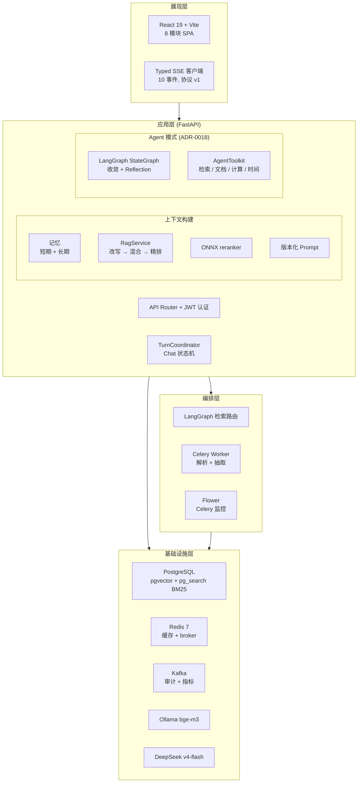
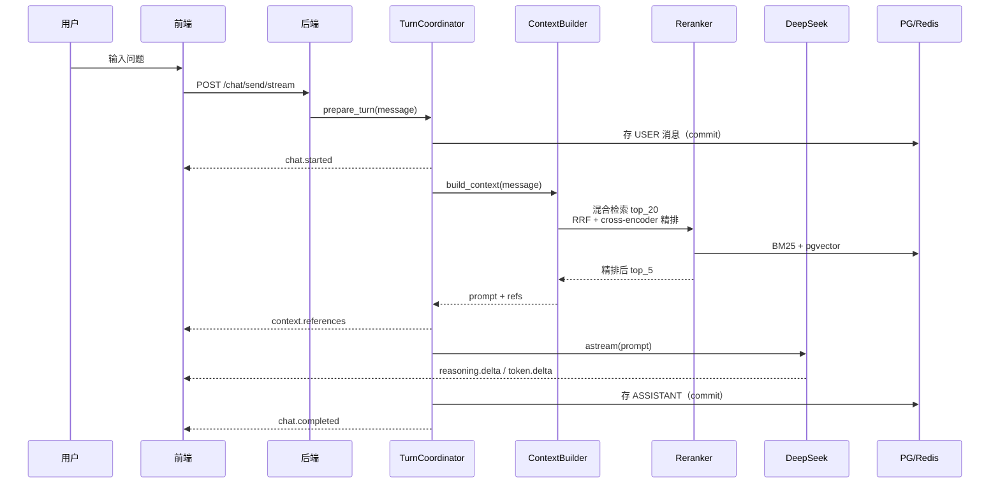
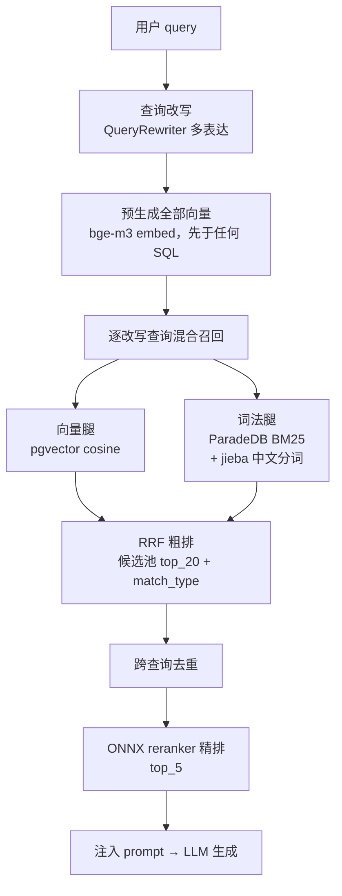
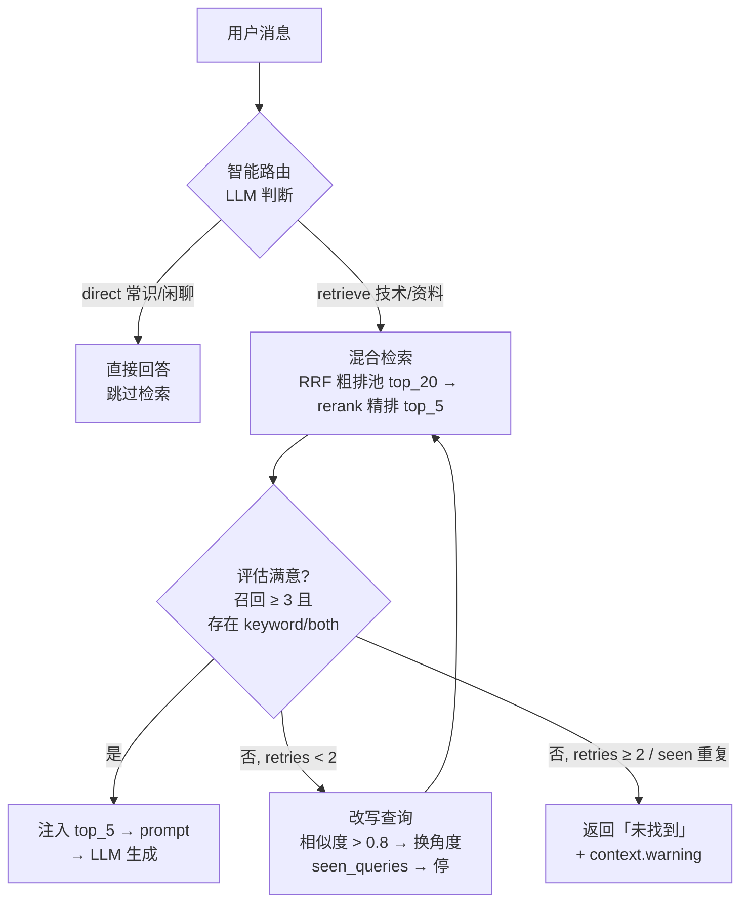
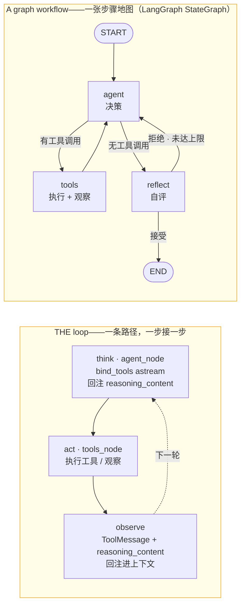
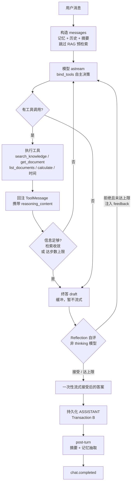
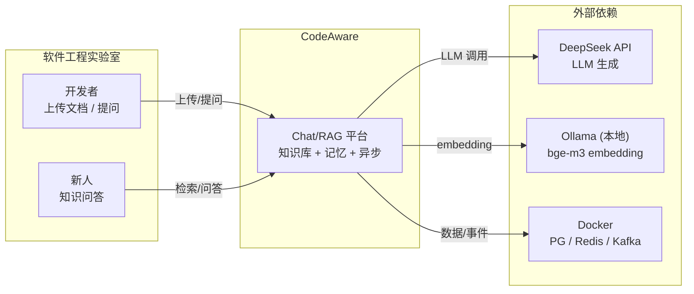

[English](README.md) | **简体中文**

---

# CodeAware

AI 驱动的研发效能平台，为**软件工程实验室团队**设计（代码评审、新人培训、团队知识检索）。
核心是**双模式 Chat**（`CHAT_MODE=rag|agent`）：**RAG 模式**做混合检索问答（BM25 + pgvector + ONNX reranker），带引用来源和可见思考过程；**Agent 模式**跑由 LangGraph StateGraph 编排的 ReAct 工具循环（ADR-0018）——模型自主选工具（知识检索/文档/计算/时间），带可见工具轨迹、收敛感知停止，以及 **Reflection**（生成后自评，不达标注入 feedback 再生成；agent 模式默认开启）。


> 项目从 Java（Spring Boot + LangChain4j）全量重构为 Python（FastAPI），Java 旧实现保留在 [java-legacy/](java-legacy/) 仅供参照。

---

## 核心能力

| 能力 | 说明 |
|---|---|
| 📄 **知识库问答** | 上传 MD/DOCX/HTML/PDF → 元素感知解析 → 分块嵌入 → 混合检索（BM25 + 向量 RRF）→ 回答**带引用来源** |
| 🧠 **思考过程流式** | DeepSeek reasoning_content 与回答分离推送（10 事件 typed SSE），可见"模型如何推理" |
| 🇨🇳 **中文检索优化** | jieba 分词让中文 BM25 从不可用变可用（中文精确 R@5: 0.25 → **1.000**） |
| 🔀 **智能路由 + 自我纠错** | LangGraph 编排：常识问题跳过检索（省延迟）；检索不理想自动改写重试（ADR-0015） |
| 🤖 **Agent 模式** | 前端可切换（`RAG`/`Agent`）的 ReAct 工具循环（LangGraph StateGraph 编排）：模型自主选工具（知识检索/文档/计算/时间），多步推理 + 收敛感知停止（eval：avg_steps 2.28、闭环率 1.0）+ 可选 **Reflection**（自评、拒绝则重写）——ADR-0016/0018 |
| 🗺️ **架构图（Agent 模式）** | 全链路架构图（守卫→编排→上下文→工具→检索栈→LLM→SSE→agent_runs），回合中**使用部分实时高亮**；纵向主链 + 可折叠分支 + 固定像素 SVG |
| 📊 **Agent Runs 页** | 每轮 Agent 回合持久化为结构化 trace + 上下文快照 → 回放（时间线/流程视图）+ 评审（失败沉淀进 eval 回归集）——ADR-0017 |
| 🛡️ **请求边界 Guardrail** | `ChatRequest` 注入检测（fail-closed 422），双模式生效；刻意不在工具结果层做（知识库是策展内容） |
| 👥 **团队化** | JWT 登录、会话按用户隔离、知识库/记忆全员共享（实验室场景） |
| 📚 **文档管理** | 列表 / 详情（分块可视化）/ 软删除 / 替换更新（ADR-0013） |
| 🧩 **长期记忆** | 对话事实自动抽取 + pgvector 向量召回，跨会话记住团队上下文 |
| 🩺 **就绪健康检查** | `/health/ready` 三态（ready / degraded / not_ready），含 **Celery worker 探活**——提前发现异步分块不可用 |

---

## 界面截图


*Chat：流式回答 + 引用来源 + 思考过程*


*知识库：文档列表 + 分块可视化 + 上传/替换/软删*


*登录：JWT 团队认证*


*Agent 模式：全链路架构图实时高亮——检索问题点亮检索栈；计算问题检索栈保持暗*


*Agent Runs 页：运行列表 + 统计 + 回放（时间线/流程视图）+ 失败评审（accepted 进 eval 回归集）*


*顶部 header 分段控制切换 RAG（确定性状态机）与 Agent（ReAct 工具循环）*

---

## 快速开始

### 前置条件

| 依赖 | 版本 | 用途 |
|---|---|---|
| [Docker Desktop](https://www.docker.com/products/docker-desktop/) | 任意 | PostgreSQL / Redis / Ollama 容器 |
| [uv](https://docs.astral.sh/uv/) | ≥0.4 | Python 包管理 |
| Node.js | ≥18 | 前端 |
| DeepSeek API key | — | LLM（`api.deepseek.com`） |

> 本地开发默认使用 `deepseek-v4-flash` 模型（可改）；embedding 走本地 Ollama bge-m3，**零 API 费**。

### 第 1 步：配置环境变量

```bash
cd codeaware-py
cp .env.example .env        # 复制模板
# 编辑 .env，至少修改：
#   LLM_API_KEY=sk-...      ← 必填，DeepSeek key
#   JWT_SECRET_KEY=...      ← 生产部署建议换随机串（openssl rand -hex 32）
```

### 第 2 步：启动基础服务并拉取嵌入模型

```bash
cd ..                       # 回到仓库根
docker compose up -d        # PG(:5433) + Redis(:6380) + Kafka(:9093) + Celery Worker + Flower(:5555)
# Ollama 本地运行 (macOS Metal GPU): brew install ollama && ollama pull bge-m3
```

### 第 3 步：一键启动（迁移 + Celery worker + admin + 后端 + 前端）

```bash
./start.sh
```

启动基础服务、执行迁移、拉起 **native Celery worker**（异步分块 / 记忆抽取——缺它上传文档会一直 `chunk_count=0`）、种子 `admin/admin123` 账号，再启动后端 + 前端。幂等（可重复执行）。启动后访问：

```text
前端:     http://localhost:5173          (admin / admin123)
OpenAPI:  http://localhost:8000/docs
健康检查: http://localhost:8000/health/ready   # ready / degraded / not_ready（含 celery 探活）
```

### 手动启动（分步）

```bash
docker compose up -d postgres redis
(cd codeaware-py && uv sync && uv run alembic upgrade head)
(cd codeaware-py && uv run celery -A app.ai.celery_app worker --loglevel=warning)  # 异步分块必需
(cd codeaware-py && uv run uvicorn app.main:app --host 127.0.0.1 --port 8000)
(cd codeaware-py/frontend && npm ci && npm run dev)
```

### 停止

```bash
kill $(cat .run/*.pid)        # 停 worker + 后端 + 前端（docker 保留）
docker compose down           # 全停（数据在 volume 中保留）
```

---

## 架构图

### 1. 系统分层架构图



### 2. Chat/RAG 模式：核心交互时序图



### 3. RAG 检索融合管线



> 改写 + embedding 等外部调用先于第一条 SQL 完成（短事务约束，ADR-0003）；词法腿索引的是 jieba 分词文本；`match_type` 追溯 vector/keyword/both 来源参与融合。

### 4. 智能路由与评估决策流图



> 评估是确定性逻辑（RetrievalEvaluator，非 LLM）：满意 = 至少 `MIN_RECALL=3` 条 **且** 至少一条 `keyword`/`both`（词法腿参与）。RRF 分数差检测已废弃——相邻排名分差恒定约 0.0003，好坏查询分布相同。改写由 `MAX_RETRY=2` 封顶 + 防打转：字符相似度 > 0.8 强制换角度、重复查询立即停止。

### 5. Agent 模式：图工作流——ReAct 循环作为步骤地图（CHAT_MODE=agent）

Agent 模式不是单条脚本化的循环，而是一个 **graph workflow（图工作流）——一张步骤地图**：LangGraph `StateGraph` 把 `agent` / `tools` / `reflect` 三个节点摆在图上，用条件边决定**每一轮**的路由。think→act→observe 循环是图中那条回边；围绕它的图才是决策地图（检索收敛 / per-tool 上限 / Reflection 自评）。



> ADR-0018 起，循环不再是手写 async generator——`agent_graph.py` 是 LangGraph `StateGraph`（`agent`/`tools`/`reflect` 节点 + 条件边）；`react_loop.py` 是保持 SSE 契约不变的薄壳。**Reflection**（agent 模式默认开启；kill-switch `AGENT_REFLECTION_ENABLED=false`）缓冲 draft、用非 thinking 模型自评、接受后一次性流式答案（无 draft 泄漏）；判定写入 `agent_runs` trace 的 `reflection` 条目。

**单回合展开**——同一流程逐步走一遍，含事务与 typed SSE 事件：



### 6. 系统上下文/边界图



**核心原则**：

- **PG 是真相源，Redis 只做可丢弃缓存**——Redis 挂掉自动回查 PG，功能不降级
- **模型等待期间不持有数据库事务**——连接池不被长时间占用
- **typed SSE 显式语义**——10 种事件带版本号和严格递增序号，同步接口 drain 同一事件流，状态机只有一份
- **双运行时可回退**——LangGraph 检索增强（`RAG_RUNTIME=graph`）异常可一键回退原路径（`service`）
- **Rerank 是可回退增强**——`reranker_enabled=False` 一键回退纯 RRF

详细设计：Chat 全链路时序、数据模型（10 表 ER）、RAG 流水线见 [docs/roadmap/current-release/README.md](docs/roadmap/current-release/README.md)。
## typed SSE 示例（10 事件协议）

新会话的 `conversation_id` 由服务端创建并在 `chat.started` 中返回：

```bash
curl -N http://localhost:8000/api/chat/send/stream \
  -H 'Content-Type: application/json' \
  -H 'Authorization: Bearer <token>' \
  -d '{"conversation_id":null,"message":"解释 RAG 完整链路"}'
```

响应是版本化事件，不是裸 token 或 `[DONE]`：

```text
id: 1
event: chat.started
data: {"protocol_version":1,"conversation_id":"...","turn_id":"...","sequence":1}

id: 2
event: context.references
data: {"protocol_version":1,...,"knowledge_refs":[...],"memory_refs":[...],"sequence":2}

id: 3
event: reasoning.delta
data: {"protocol_version":1,...,"sequence":3,"delta":"首先分析..."}

id: 4
event: token.delta
data: {"protocol_version":1,...,"sequence":4,"delta":"RAG 完整链路包括..."}

event: chat.completed
data: {"protocol_version":1,...,"sequence":N}
```

---

## 技术栈

| 层 | 选型 | 备注 |
|---|---|---|
| 框架 | FastAPI + Pydantic v2 | async HTTP + typed SSE |
| LLM | DeepSeek v4-flash (langchain-deepseek) | ChatDeepSeek 提取 reasoning_content |
| 向量 | Ollama bge-m3 1024-d | 本地 Metal GPU embedding, ~128ms/次, 零 API 费 |
| 关系 DB | PostgreSQL 16 + asyncpg | PG-first 真相源 |
| 向量索引 | pgvector HNSW cosine | 内联向量, 同事务 commit |
| 词法检索 | ParadeDB pg_search BM25 | default tokenizer; pg_trgm 回退 |
| 检索增强 | LangGraph StateGraph（ADR-0015） | 智能路由 + 自我纠错（match_type 检测） |
| Reranker | ONNX bge-reranker-v2-m3 | RRF 后 cross-encoder 精排（MRR +0.058） |
| 缓存 | Redis 7 | 可丢弃, PG fallback |
| 前端 | React 19 + Vite + TypeScript | 8 模块 SPA（无 router） |
| 包管理 | uv + Alembic | 依赖锁定 + 迁移回退 |

---

## 当前状态

| 指标 | 数值 |
|---|---|
| 后端测试 | **357 passed**, 0 failed |
| 前端测试 | **62 passed** |
| API 端点 | 37 个 |
| 数据表 | 10 张 |
| ADR | 18 篇 (0001-0018) |
| Alembic head | 0012 |
| 完成阶段 | C1-C6 + 团队化 A/B/C + 文档管理 + 异步任务队列 + Kafka 事件流 + **Agent 模式（前端切换，LangGraph StateGraph 编排）+ LLMOps 闭环（trace/回放/评审/guardrail）+ Reflection（自评，可选）** |

**检索评估摘要**（真实 bge-m3，60 条 golden）：

- 全阶段演进追踪（C3→C4→jieba→LangGraph→RAGAS）：[retrieval-evolution.md](docs/optimization/retrieval-evolution.md)
- 混合检索 R@5 = 0.975, MRR = 0.941（含 reranker）（[top_k 敏感性](docs/optimization/topk-sensitivity.md)）
- jieba 中文 BM25：中文精确 R@5 0.25 → **1.000**（[ADR-0011](docs/decisions/adr/0011-jieba-chinese-bm25-segmentation.md)）
- LangGraph 路由准确率 **60/60 = 1.000**，重试触发率 0.019（[评估报告](docs/optimization/rag-graph-eval.md)）
- 生成质量 RAGAS：Faithfulness 0.931 / Answer Relevancy 0.793（[评估报告](docs/optimization/ragas-eval.md)）

完整评测数据（C3/C4 词法升级、按类别、敏感性分析）见 [docs/optimization/](docs/optimization/README.md)。

---

## 测试

后端测试禁止裸跑 `pytest`——安全执行器创建随机 disposable PG/Redis，拒绝开发库和远程目标：

```bash
# 全量测试（安全）
(cd codeaware-py && uv run python scripts/run_tests_safe.py -q)

# 覆盖率
(cd codeaware-py && uv run python scripts/run_tests_safe.py --cov=app --cov-report=term-missing -q)

# 前端
(cd codeaware-py/frontend && npm run test && npm run lint && npm run build)
```

---

## 技术决策一览

| 决策 | 选了 | 评估后没选 |
|---|---|---|
| LLM adapter | ChatDeepSeek（提取 reasoning） | ChatOpenAI（丢弃第三方字段） |
| 词法检索 | ParadeDB BM25 (default tokenizer) + jieba 中文分词 | pg_trgm（C3 噪声拖累 RRF） |
| PDF 解析 | pdfminer.six（字号标题检测） | unstructured.partition.pdf（拖 torch）；pdfplumber（表格提取，暂缓——暂无表格密集型文档） |
| Reranker | ONNX bge-reranker-v2-m3（ADR-0009 重新评估落地） | torch CrossEncoder（依赖过重） |
| 意图识别 | 不做（90% 知识问题） | 加分类引入漏检风险 |
| LangGraph | 检索层智能路由 + 自我纠错（ADR-0015）+ Agent 工具循环编排（ADR-0018） | 手写循环保留到工具复杂度上升（ADR-0014/0016，ADR-0018 重新评估） |
| 任务队列 | Celery + Redis | 异步文档解析/记忆抽取, Flower 监控 |
| 事件流 | Kafka (Confluent) | 审计日志/检索指标/异常事件 |
| Refresh token | 不要（access 7 天） | 实验室不需要 refresh 轮换 |
| 并发 guard | 进程内 set[str] | PG advisory lock（多 worker 时再做） |

---

## 当前边界

| 有 | 没有 |
|---|---|
| JWT 认证 + 会话按用户隔离 | 项目管理（X-Project-ID） |
| 知识库/记忆全员共享 | 知识库按人权限 |
| 10 事件 typed SSE | WebSocket |
| BM25 + pgvector RRF **粗排** + ONNX cross-encoder **精排** | LLM-as-reranker / torch CrossEncoder |
| 元素感知分块 + 扫描 PDF 拒绝 | OCR |
| PDF 表格压平为纯文本流（无行列结构） | pdfplumber `extract_tables()` → Markdown 表格序列化（待表格密集型文档后引入） |
| fail-closed disposable 测试栈 | 裸 pytest |
| 单 worker local-first | 多 worker / K8s |
| Celery 异步任务队列 | 外部动作工具（sandbox / Git / MCP） |
| Kafka 事件流 (审计/指标) | Grafana / Loki 面板 |
| Flower 任务监控面板 | — |
| 确定性 Chat 状态机 **+ 前端可切换 Agent 工具循环**（LangGraph StateGraph，ADR-0016/0018） | 外部动作工具 |
| Agent run trace + 回放 + 失败沉淀进 eval（ADR-0017） | Chat 页实时高亮（P2，暂缓——事件源无关架构已预留） |
| 答案缓存（仅同步端点） | 流式端点答案缓存 |

## 设计与实际差异

设计阶段与最终实现的差异点及取舍原因：

| 设计点 | 设计意图 | 实际实现 | 原因 |
|---|---|---|---|
| **答案缓存** | 同步+流式都缓存 | **仅同步端点** | 流式需保留引用/思考展示，缓存回放会丢失；同步全阻塞收益最大（31s→0.02s）。详见 [sync-vs-stream-endpoints.md](docs/optimization/sync-vs-stream-endpoints.md) |
| **Reranker** | 暂缓（torch 依赖） | **ONNX Runtime 落地** | 60 条 golden 暴露 cross_doc MRR=0.750 短板；ONNX 无 torch 依赖，MRR +0.058 |
| **负例降级** | 无关查询返回"未找到" | **保持硬答 + 前端提示** | 前端已有"未检索知识库"标注，降级收益小、改动大，未做 |
| **Ollama 部署** | Docker 容器 | **macOS 原生（Metal GPU）** | Docker 无法直通 GPU 到容器；原生 Metal 加速 45x |
| **Flower 部署** | 独立容器 | **与 Celery Worker 合并容器** | 同一镜像一个 entrypoint 起两进程，简化编排 |
| **Kafka 镜像** | bitnami/kafka | **confluentinc/cp-kafka** | bitnami 镜像拉取限流，本地已有 confluent 镜像 |

> 原则：**有实测收益或解决依赖约束的设计变更才落地**；其余保持原设计，边界明确记录。

---

## 文档入口

| 文档 | 用途 |
|---|---|
| [AGENTS.md](AGENTS.md) | 开发规则 |
| [docs/roadmap/current-release/README.md](docs/roadmap/current-release/README.md) | 当前路线 (C1-C6) |
| [docs/roadmap/团队化升级计划.md](docs/roadmap/团队化升级计划.md) | 团队化设计 |
| [docs/roadmap/团队化升级-实施计划.md](docs/roadmap/团队化升级-实施计划.md) | 团队化落地 |
| [docs/roadmap/部署上线指南.md](docs/roadmap/部署上线指南.md) | 部署 (局域网 + 云) |
| [docs/roadmap/chat-to-agent/personal/README.md](docs/roadmap/chat-to-agent/personal/README.md) | Agent 路线（锁定） |
| [docs/optimization/](docs/optimization/README.md) | 检索优化评估（jieba/top_k/LangGraph/RAGAS） |
| [docs/decisions/adr/](docs/decisions/adr/) | 18 篇架构决策 (0001-0018) |
| [docs/interview/面试准备指南.md](docs/interview/面试准备指南.md) | 面试深挖 |
| [docs/interview/面试速通版.md](docs/interview/面试速通版.md) | 面试速通 |
| [docs/interview/项目简历介绍.md](docs/interview/项目简历介绍.md) | 简历粘贴 |
| [docs/migration/Python重构迁移文档.md](docs/migration/Python重构迁移文档.md) | 迁移历史 |
