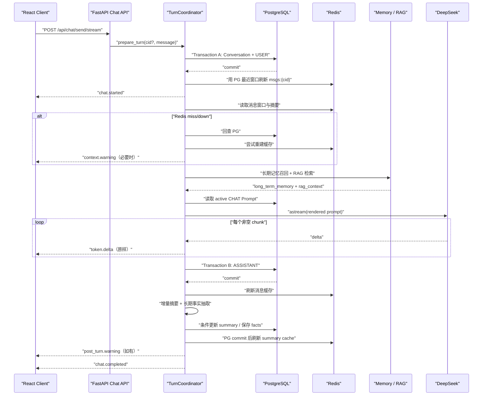

# CodeAware 项目面试准备指南

> 本文只讲当前 Python 实现已经交付并有测试证据的能力。Java 模块仅作为迁移背景，
> 不能再用来描述当前运行时。
>
> 当前版本是**双模式 Chat**：默认确定性 RAG 状态机，另提供 `CHAT_MODE=agent` 的
> ReAct 工具循环（LangGraph StateGraph 编排 + Reflection 自评，默认开）。
> 阶段证据见 `docs/roadmap/current-release/evidence/`。

---

## 一、先记住项目主线

CodeAware 是一个 AI 驱动的研发效能平台,针对**软件工程实验室团队**的日常开发痛点设计：代码评审周期长、新人培训依赖口头传帮带、团队文档和规范散落缺乏统一入口。提供 Code Review、单测生成、AIReadMe、Chat、Knowledge、Memory 和 Prompt 等能力。

最初的项目定位是“把 AI 能力接入研发流程，降低 Code Review、单测编写和项目知识
传递的成本”。这个定位仍然成立，但面试时要把“业务愿景”和“当前已实现能力”分开：

| 最初定位 | 当前已经实现 | 面试边界 |
|---|---|---|
| AI 研发流程管理 | CR、Unit Test、AIReadMe、Chat 等独立 API/UI 与持久化记录 | 尚未实现 GitLab CI 自动触发，不说已接入企业流水线 |
| 结构化 AI Code Review | 角色、维度、等级、模板和结构化输出 | AI 是语义补充，不替代 Sonar 或人工审批 |
| AI 友好型项目 | AIReadMe 读取 allowlist 内真实快照，记录 hash/version | 当前不自动把生成文件写回源仓库 |
| 团队智能问答知识库 | Chat + 两级记忆 + Knowledge RAG | 当前是本地单用户/单 worker |
| 短期记忆 | PG 完整消息 + Redis 最近窗口 + PG/Redis 摘要 | 不再描述为“Redis 保存后异步落 PG” |
| 长期记忆 | 主动抽取原子事实 + bge-m3 + pgvector cosine 召回 | 当前没有复杂记忆治理或用户画像系统 |
| RAG 召回 | 查询改写 + 结构分块 + pgvector cosine + BM25 + RRF 粗排 + ONNX cross-encoder reranker 精排 | C4：ParadeDB pg_search 真 BM25 替换 pg_trgm，三路门禁全过，fused MRR 0.906->0.934；C5：元素感知序列化让 DOCX/HTML/PDF 标题穿到分块层（之前文件上传退化为定长滑窗），扫描版 PDF 显式拒绝；Reranker：ONNX bge-reranker-v2-m3 精排，MRR 0.883→0.941 |

原始项目描述中的“线上缺陷率下降 60%”“效率提升 80%”属于目标性表达。除非能够给出
样本量、对照组、统计周期和计算方式，否则面试时不要作为已经被项目证明的指标。当前更
可靠的量化证据是自动测试、覆盖率、完整请求链、故障注入和可重复演示。

面试时不要平均介绍所有页面。项目最值得讲的主线是：

```text
以 Chat 为核心域
→ 短期记忆、长期记忆和 RAG 都在一条问答链路中汇合
→ Prompt 是版本化资产
→ PostgreSQL 保存业务真相
→ Redis 只做可丢弃缓存
→ typed SSE 把生成、降级和完成语义显式交给前端
```

Code Review、Unit Test、AIReadMe 是复用 Prompt、结构化输出和持久化基建的薄工具；
Chat 才体现系统的状态、事务、检索、流式传输和故障处理深度。

### 30 秒电梯演讲

> 「我为软件工程实验室团队做了一个 AI 研发效能平台,解决三个实际问题：代码评审慢、新人培训靠口口相传、团队知识散落没统一检索入口。核心域是带两级记忆和 RAG 的 Chat。这个项目不只是把问题发给模型：一条请求
> 会先提交用户消息，再并入历史摘要、最近消息、长期记忆和知识库检索结果，通过数据库
> 中的版本化 Prompt 调用 DeepSeek，并用 typed SSE 流式返回。消息和摘要以 PostgreSQL
> 为真相，Redis 只做提交后的缓存；Redis、RAG 或记忆降级会变成可观察 warning，不会
> 伪装成成功或破坏核心消息。知识库检索采用 pgvector 语义召回与 ParadeDB BM25 词法召回（已从 pg_trgm 升级，60 条 golden 门禁全过），
> 再用 RRF 融合。我还为断线取消、同会话并发、摘要水位线、空环境启动和破坏性测试隔离
> 做了完整闭环。」

### 2 分钟展开版

> 「我先把 Chat 拆成一条明确的单轮状态机，而不是把数据库、Redis、模型和后处理全塞进
> 一个 service 方法。`TurnCoordinator` 同时服务同步和流式接口：Transaction A 创建
> 会话并提交 USER；提交后才刷新 Redis，然后发 `chat.started`。接着读取摘要和最近
> 消息，召回长期记忆，执行 RAG，把四类上下文渲染进 active CHAT Prompt。模型输出通过
> `token.delta` 原样传给前端，完成后 Transaction B 提交 ASSISTANT，再执行消息缓存
> 刷新、增量摘要和长期记忆抽取，最后才发 `chat.completed`。
>
> 这里最关键的设计是边界清楚：模型和 embedding 这类外部网络等待期间不占用数据库
> transaction；PG 是真相源，Redis miss 会回查 PG 并重建缓存；非核心增强失败发
> `context.warning` 或 `post_turn.warning`，模型或消息持久化失败才发 `chat.failed`。
> 客户端断开时关闭上游模型流，保留已经提交的 USER，不保存 partial assistant，并释放
> 同会话 guard。
>
> RAG 也分成写入链和查询链。写入时 Document 只保存一份全文，KnowledgeChunk 保存
> 结构化分块和内联 1024 维向量。查询时先改写成多个检索表达并预生成向量，再在短数据库
> session 中分别跑 pgvector cosine 和 BM25 词法召回（`LexicalRecallPort`,默认 ParadeDB pg_search），每条腿取候选，用
> `1/(60+rank)` 做 RRF 粗排出候选池（默认 20 条），再交给 cross-encoder reranker
> （ONNX Runtime）精排出 top-5，标记结果来自 vector、keyword 或 both，按 chunk id
> 去重后注入 Chat——二阶段流水线，RRF 管召回、reranker 管排序。」

### 核心决策链：六步推导，每个选择都有"为什么不选替代方案"

面试官问"为什么这样设计"时，不要零散回答。以下六步推导串联整个架构——每一步的前件正是上一步的结论：

```text
决策 1：PG 是真相，Redis 是缓存
  → 因为消息和摘要需要外键、迁移、约束、审计。Redis 先写 + PG 回滚 = 幽灵数据。
  → 为什么不反过来？因为 Redis 不能做外键和迁移，缓存不能当审计源。
  ⇒ 结论：PG commit → Redis refresh（不是常见的 Redis-first）。

决策 2：短事务 + 外部调用的严格时序
  → 如果 SQL 开启事务等待 LLM 流式返回 30 秒，连接池被占满、行锁膨胀。
  → 为什么不放一个事务里？因为 LLM/embedding 是不可控外部等待。
  ⇒ 结论：短交易读/写 PG → 关闭 session → 调 LLM → 新短交易落结果。

决策 3：Typed SSE 协议（10 事件，含 agent 模式 tool.call/tool.result），而不是裸 data: token + [DONE]
  → [DONE] 不能证明数据库 commit 成功，裸 token 不能告诉新会话 cid。
  → 为什么不做 WebSocket？因为 Chat 是单向流 + 请求/响应模式，WebSocket 的双向开销多余。
  ⇒ 结论：每个事件带 protocol_version / sequence / turn_id，completed = commit 完成 + post-turn 收口。

决策 4：两条召回腿（BM25 + pgvector）用 RRF 粗排，reranker 精排
  → BM25（C4 真实现）抓词面（类名/版本号/错误码），pgvector 抓语义（同义改写），RRF 融合出候选池。
  → 早期为什么不加 reranker？当时 MRR 0.934 已高、+0.01 边际收益未实测，且 sentence-transformers
    拉 torch 与 C5 约束冲突。
  → 后来怎么落地的？ONNX Runtime 跑 bge-reranker-v2-m3（无 torch 依赖），60 条 golden 暴露
    cross_doc MRR=0.750 短板，实测 MRR 0.883→0.941（+0.058）。
  ⇒ 结论：RRF 粗排（多路候选池） + cross-encoder 精排（top_k），reranker 在依赖约束解除后落地。

决策 5：八个功能域，Chat 是核心域，其余是复用 Prompt + 结构化输出基建的薄工具
  → Code Review / Unit Test / AIReadMe 用同一套 Prompt 版本化 + 持久化，没有各自的"引擎"。
  → 为什么不每个域做深？因为当前单用户规模，Chat 的状态机（事务/检索/流式/故障）才是复杂度的重心。
  ⇒ 结论：所有深度只在 Chat 里体现，其余模块只承诺"生成并保存"。

决策 6：Agent 模式——先评估暂缓，条件满足后落地，再迁 LangGraph + Reflection
  → 最初评估 ReAct 升级：thinking 模式工具调用未验证（硬约束），当时 90% 是单轮知识问题 → 记 ADR-0016 暂缓、留重启条件。
  → 为什么后来又做？用户明确要做 agent 模式线，重启条件触发 → 原型验证（H1/H2/H3）走通 → 落地 CHAT_MODE=rag|agent 双模式（5 只读工具）。
  → 为什么迁 LangGraph？agent 落地后启发式变多（防打转/per-tool 上限/收敛检测），手写 while 维护成本上升；
    ADR-0014 预留的"多工具复杂度上升 LangGraph 更优"条件满足 → 主循环迁 StateGraph（agent/tools/reflect 节点 + 条件边），
    对外薄壳、SSE 契约不变；Reflection 默认开（draft 缓冲修 token 泄漏 + 非 thinking 模型 + function_calling 结构化输出）。
  ⇒ 结论：Agent 不是"一上来就做"也不是"永不考虑"——"评估→暂缓→条件满足→落地→再演进"才是完整的决策链。

决策 7：为什么不做意图识别？
  → `_build_context` 对每条消息无条件走记忆召回 + RAG 检索，没有 SMALL_TALK/KNOWLEDGE 路由。
  → 为什么不做？用户 90%+ 是知识问题，闲聊极少。意图分类的误判漏检代价（把知识问题误判成闲聊）
    远大于闲聊多等半秒——和 6.12/6.16 是同一套"先测收益再动"的逻辑。
  ⇒ 结论：优化看场景收益，不是看别人有没有。触发条件是闲聊占比 >30% 或多数据源需路由。

决策 8：为什么先做 jieba 分词，reranker 后来才落地？
  → 两者都是改检索质量，但收益量级差一个数量级：
    reranker 早期门禁 MRR+0.01（torch 依赖 + 0.5s 延迟）；jieba 中文精确 R@5 0.25→1.000
    （纯 Python，零依赖，延迟无劣化）。同样是"评估后做"，先选收益大的那个。
  → 后来为什么又做 reranker？60 条 golden 扩展暴露 cross_doc MRR=0.750 短板；
    ONNX Runtime 绕开 torch 依赖，实测 MRR 0.883→0.941（+0.058），候选池可配置。
  ⇒ 结论：优化的优先级看实测收益。jieba 先做（收益大、零成本），reranker 在依赖约束
     解除且数据暴露短板后落地——两者不是二选一，是先后。 
```

面试时把这个链条浓缩成：

> 「我的架构有八个关键决策，每个都是从一个明确的问题推出来的：
> PG-first 是为了审计和约束，短事务是为了不把 LLM 等待挂进连接池，
> typed SSE 是为了让 frontend 知道 commit 有没有成功，
> BM25+RRF 是粗排融合，reranker 用 ONNX Runtime 精排（绕开 torch 依赖，MRR +0.058），
> Chat 厚/工具薄是因为状态机复杂度集中在检索和流式链路，
> Agent 是先评估暂缓（无真实需求）、条件满足后落地为双模式，编排再迁 LangGraph + Reflection（默认开），
> 不做意图识别是因为用户 90% 知识问题、加分类引入漏检风险大于收益，
> 做 jieba 是因为它让中文 BM25 从残废变可用（R@5 +0.34），reranker 是后续依赖约束
> 解除后（ONNX）才落地、实测 MRR +0.058——
> 每个选择都有一个"做或不做"的理由。」

---

## 二、当前技术架构

```text
React + Vite
    │
    │ HTTP / typed SSE
    ▼
FastAPI Router
    │
    ├── TurnCoordinator ── Chat 单轮状态机
    │      ├── ShortTermMemoryManager
    │      ├── LongTermMemoryManager
    │      ├── RagService
    │      └── PromptTemplateManager
    │
    ├── CodeReview / UnitTest / AIReadMe
    └── Knowledge / Memory / Prompt API

PostgreSQL 16 + pgvector
    ├── Conversation / Message / Prompt / Record
    ├── LongTermMemory Vector(1024)
    └── Document / KnowledgeChunk Vector(1024)

Redis 7                    Ollama
    ├── msgs:{cid}             └── bge-m3 1024-d embedding
    └── summary:{cid}

DeepSeek OpenAI-compatible API
    └── Chat / 摘要 / 查询改写 / 事实抽取 / 结构化生成
```

### 为什么选择这套栈

| 技术 | 当前用途 | 选择理由 |
|---|---|---|
| FastAPI | async HTTP、SSE、OpenAPI | 与异步 LLM/Redis/数据库链路契合，契约可直接验证 |
| LangChain | DeepSeek/Ollama adapter | 统一模型调用和结构化输出，不把领域逻辑绑死在 SDK 上 |
| SQLAlchemy 2 async | 事务和 ORM | 明确控制短 transaction，适合 PG-first 设计 |
| PostgreSQL + pgvector + pg_search | 关系数据、向量、BM25 词法 | 单库完成业务真相、cosine 和 BM25；C4 已从 pg_trgm 升级 |
| Redis async | 短期消息和摘要缓存 | 低延迟且可丢弃；失效后可由 PG 重建 |
| Ollama bge-m3 | 本地 embedding | 1024 维、多语言、本地可运行，不消耗远程 embedding 费用 |
| Alembic + uv | 迁移和依赖 | 数据结构可回退，依赖锁可复现 |

不要再回答“换 Pinecone 只改一行配置”或“连接失败自动切换”。当前实现统一了
`VectorRecallService`，但实际存储就是 PostgreSQL/pgvector；迁移到其他向量库仍需要
实现、数据迁移和重新验收。

---

## 三、Chat 核心设计

### 3.1 设计目标

Chat 不是单次 `LLM.invoke()`。当前设计同时解决六个问题：

1. 新会话必须尽早拿到真实 `conversation_id`。
2. 流式 token 的前导空格、换行和 Markdown 不能丢。
3. USER、ASSISTANT、摘要和缓存的成功语义必须真实。
4. Redis、Memory、RAG 等增强能力故障时，核心 Chat 可以降级完成。
5. 模型失败、客户端断线和同会话并发不能制造脏数据。
6. 外部模型等待不能长期占用数据库 transaction。

### 3.2 关键对象的职责

| 对象 | 职责 | 不负责什么 |
|---|---|---|
| `chat.py` Router | HTTP 校验、前置错误、SSE 格式化 | 不复制业务状态机 |
| `TurnCoordinator` | 单轮编排、事务顺序、事件、warning、guard；RAG/Agent 双模式都从这里进入 | 不实现 ReAct 循环细节（交给 `react_loop` → `agent_graph`） |
| `ShortTermMemoryManager` | 消息窗口、摘要读取/写入、PG/Redis fallback | 不决定 HTTP 终态 |
| `LongTermMemoryManager` | 原子事实抽取、内联向量、语义召回 | 不存外部 Knowledge |
| `RagService` | 查询改写、混合检索、去重和上下文格式化 | 不直接生成最终回答 |
| `PromptTemplateManager` | 获取 active CHAT 模板并渲染占位符 | 不硬编码 Chat system prompt |

同步接口 `POST /api/chat/send` 和流式接口
`POST /api/chat/send/stream` 共用同一个 `TurnCoordinator`。同步接口只是 drain 同一事件流
并组合最终结果，因此两条入口不会各自演化出不同的事务或错误语义。

### 3.3 一条询问请求的完整链路



按代码时序可以拆成 11 步：

1. Router 校验请求；已有 `conversation_id` 时先确认会话存在。
2. 获取 per-conversation turn guard；相同 cid 已在生成则返回稳定 409。
3. Transaction A 创建 Conversation（新会话）并写 USER，显式 commit。
4. 从 PG 最近窗口重建 Redis 消息缓存；失败只记录 warning。
5. 发出首事件 `chat.started`。此时 cid 和 USER 已可从 PG 查询。
6. 构建上下文：摘要 + 最近消息 + 长期记忆 + RAG；排除刚保存的当前 USER。
7. 从数据库加载 active CHAT Prompt，渲染四个占位符。
8. 调用 `ChatOpenAI.astream()`，每个非空 chunk 原样发送 `token.delta`。
9. Transaction B 保存完整 ASSISTANT 并 commit；partial assistant 永不落库。
10. post-turn 刷新消息缓存、增量摘要并抽取长期事实。
11. 所有 post-turn 要么成功、要么转成 warning 后，才发 `chat.completed` 并释放 guard。

### 3.4 Prompt 为什么不会重复当前问题

CHAT 模板使用四个占位符：

```text
{{long_term_memory}}
{{rag_context}}
{{conversation_history}}
{{user_message}}
```

Transaction A 已经把当前 USER 保存到了消息表。构建 history 时，如果窗口最后一条正是
本轮 USER，会先移除，再把当前问题只通过 `user_message` 注入。这样既能做到
`chat.started` 前消息已提交，又不会在最终 Prompt 中把问题重复两次。

### 3.5 Typed SSE 协议

每个事件都有：

```text
protocol_version = 1
conversation_id
turn_id
sequence
```

SSE 的 `id` 等于 `sequence`，从 1 严格递增。

| 事件 | 含义 |
|---|---|
| `chat.started` | 首事件；Conversation 与 USER 已提交 |
| `context.warning` | Redis 读取、Memory 或 RAG 降级，但仍可继续生成 |
| `token.delta` | 模型原始非空 chunk，不 trim |
| `post_turn.warning` | ASSISTANT 已提交，摘要、抽取或缓存刷新降级 |
| `chat.completed` | ASSISTANT 已提交，post-turn 已完成或转 warning |
| `chat.failed` | context/model/persist 等核心阶段失败；不保存 partial assistant |

为什么不用裸 `data: token` + `[DONE]`：

- 裸 token 无法告诉前端新会话 cid。
- `[DONE]` 不能证明数据库和后处理已经完成。
- 无法区分“核心失败”和“增强能力降级”。
- 结构化事件可以做版本校验、顺序校验和前端状态机。

### 3.6 PG-first 与 Redis-cache

当前一致性原则是：

```text
PostgreSQL commit
→ Redis refresh
```

而不是：

```text
先写 Redis
→ 再等请求结束时提交 PG
```

原因：

- 如果 Redis 先成功而 PG 回滚，会出现数据库里不存在的“幽灵消息”。
- 如果 Redis 故障阻止 PG 写入，缓存反而成了核心链路单点。
- PG 更适合承担历史、约束、迁移和审计；Redis 适合作为可重建窗口。

消息缓存使用 `msgs:{cid}`，保留最近 **20 条消息**，TTL 7 天；摘要缓存使用
`summary:{cid}`。Redis miss 或读取失败时：

1. 从 PG 查询最近消息或 `conversations.summary`；
2. 正常使用 PG 结果继续 Chat；
3. 再尝试精确替换 Redis 缓存；
4. 回填失败则发 warning。

精确替换而不是盲目 append，可以避免 Redis 曾有脏数据时产生重复窗口。

### 3.7 为什么模型调用期间不持有数据库事务

LLM、Ollama embedding 和查询改写都是不可控的外部等待。如果先执行 SQL 开启事务，
再等待模型：

- 连接池中的连接会被长时间占用；
- 行版本和锁持有时间变长；
- 高并发下容易耗尽连接池；
- 超时重试会把数据库事务生命周期进一步放大。

因此 Chat 使用多个短 session：

```text
短事务读/写 PG → 关闭 session
→ 外部 LLM/embedding
→ 新短事务落结果 → commit
```

RAG 也先 `prepare_search()` 完成查询改写和全部 embedding，再进入只执行 SQL 的
`search_prepared()`。

### 3.8 取消与并发

当前 local-first 版本使用进程内 per-cid guard：

- 同一会话只能有一个进行中的 turn；
- 第二个请求在建立 SSE 前返回 `409 CHAT_TURN_IN_PROGRESS`；
- 不同新会话可以并行。

客户端 Abort 时，`StreamingResponse` 的关闭路径会继续 `aclose()` 内层事件生成器和模型
流：

- 保留 Transaction A 已提交的 USER；
- 丢弃内存中的 partial assistant；
- 不伪造 `chat.completed`；
- 释放 turn guard，允许后续继续该会话。

要主动说明限制：这个 guard 只适用于当前单进程/单 worker。若未来扩到多 worker，需要
改成 PostgreSQL 条件 lease 或其他跨进程协调，不能宣称当前已经分布式安全。

---

## 四、短期记忆与摘要设计

### 4.1 短期记忆不是“Redis 就是真相”

准确表述：

```text
PG messages = 完整消息真相
Redis List = 最近 20 条消息缓存
PG conversations.summary = 摘要真相
Redis summary:{cid} = 摘要缓存
```

历史详情 API 直接按消息 ID 正序查询 PG。Redis 只用于构建低延迟上下文，并始终有
PG fallback。

### 4.2 摘要如何真实触发

配置：

```text
MEM_SUMMARY_THRESHOLD = 10
MEM_SUMMARY_INTERVAL = 5
MEM_SUMMARY_BATCH_SIZE = 20
MEM_SUMMARY_MAX_CHARS = 12000
```

触发条件：

```text
message_count >= threshold
并且
message_count - summary_message_count >= interval
```

因此默认第一次在 5 轮问答后触发：5 条 USER + 5 条 ASSISTANT = 10 条消息。

`summary_message_count` 是水位线，解决两个问题：

- Redis 只有最近 20 条，不能用 `LLEN` 判断全量历史。
- 同一消息总数重复执行 post-turn 时不能重复摘要。

### 4.3 增量摘要完整过程

```text
短事务读取：
  existing summary
  expected watermark
  total message count
  最旧的最多 20 条未摘要消息
→ 关闭 session
→ 构造不超过 12000 字符的 Prompt
→ 调摘要 LLM
→ 新短事务条件更新：
  WHERE summary_message_count = expected watermark
→ 同时写 summary + target watermark
→ commit
→ 刷新 Redis summary cache
```

Prompt 超限时：

- 既有摘要最多占 `min(2000, max_chars / 4)`，保留首尾并标记中间截断；
- 新消息按时间顺序加入；
- 最后一条放不下时允许尾部截断并标记；
- 水位线只推进实际进入 Prompt 的消息数，不跳过积压。

条件更新是一个轻量 optimistic concurrency control。若另一个更新者已经推进水位线，
旧结果不会覆盖新摘要。

### 4.4 摘要失败怎么处理

- LLM 异常或空白结果：不推进水位线，发 `summary/SUMMARY_FAILED`。
- PG commit 失败：不刷新 Redis。
- Redis 写失败：PG 摘要保留，发
  `summary_cache/REDIS_UNAVAILABLE`，最终仍可 completed。
- Redis miss：从 PG 读取已存在摘要，不重新扫描消息临时计算。

面试时可概括为：

> 「摘要是可重试的增强结果，水位线只随成功的 PG 条件更新推进；缓存失败不改变摘要
> 真相。」

---

## 五、长期记忆设计

短期记忆解决“这次会话刚聊了什么”，长期记忆解决“哪些原子事实值得以后语义召回”。

当前实现：

```text
最近消息
→ LLM 提取最多 5 条原子事实
→ 先生成全部 bge-m3 embedding
→ 短事务写 long_term_memories
→ embedding 内联 Vector(1024)
→ conversation_id 标记来源
```

事实示例：

```text
“用户使用 FastAPI + SQLAlchemy 2.0”
```

而不是：

```text
“他用这个框架”
```

召回时对用户问题生成向量，通过 cosine similarity 取 Top-K，再注入
`long_term_memory`。长期 Memory 是对话内生事实；Knowledge 是用户上传的外部资料，
两者来源和生命周期不同，不能混成一张表。

**召回阈值（A 层修复）**：召回设余弦相似度下限 `mem_recall_threshold=0.5`
（`settings` 可调，`context_builder` RAG/Agent 两处共用）。原来的 `threshold=0.0`
是"全召回"——随便一个问题都灌 5 条无关记忆进 prompt 误导模型（真实 bge-m3 实测：
无关查询在 0.0 时召回 5 条 sim≈0.46 的噪声，0.5 时干净为 0）。配套的提示词 v2 里有
**记忆仲裁**规则（见 7.2）：记忆是"线索"而非"结论"，与知识库冲突以知识库为准——阈值
管"召回哪些"，提示词管"召回的怎么用"，两层配合。

当前生产路径在消息数达到 4 且该会话尚无已抽取记忆时尝试抽取。抽取失败发
`memory_extraction/EXTRACTION_FAILED`，不会撤销已经提交的回答。

---

## 六、RAG 设计与混合检索

### 6.1 为什么把 Knowledge 和 Memory 分开

| 维度 | Long-term Memory | Knowledge |
|---|---|---|
| 来源 | 对话中抽取的事实 | 用户上传的外部文档 |
| 粒度 | 原子事实，不分块 | 文档 → 多个 chunk |
| 检索 | 默认纯向量 | 关键词 + 向量混合 |
| 删除 | 删除事实 | 删除 Document 级联 chunks |
| 用途 | 用户偏好、项目约束、重要背景 | 手册、规范、项目资料 |

### 6.2 文档写入/索引链

```text
POST multipart Markdown/text/HTML/DOCX/PDF
→ 校验类型、大小和解析后字符数
→ 解析 + 元素感知序列化（C5）：
   MD/HTML/DOCX：unstructured partition，Title 编回 `#`、ListItem 编回 `-`
   PDF：pypdf 文本层探针（扫描版返回空 -> 显式拒绝 KNOWLEDGE_PDF_NO_TEXT_LAYER）
        + pdfminer 按行字号检测标题（不走 unstructured.partition.pdf，它无条件拖 torch）
→ chunk_by_title 按标题结构分块（默认 500 字 / overlap 50，C5 未改分块参数）
→ bge-m3 生成 1024 维向量
→ documents 保存全文一次
→ knowledge_chunks 保存 chunk_content + inline embedding
→ commit
```

> C5 之前解析器用 `str(e.text)` 把标题元素压成纯文本，chunker 看不到 `#` 边界，
> DOCX/HTML/PDF 文件上传退化为定长滑窗。C5 只改解析器输出（编回 `#`），分块器
> `chunk_by_title` 一行没动——同一个结构分块策略，让更多格式的标题真正生效。

表设计：

```text
documents
  id, title, source_type, project_name, content

knowledge_chunks
  id, document_id, chunk_index, chunk_content, embedding Vector(1024)
```

全文只在 `documents.content` 保存一次，避免每个 chunk 重复一份全文。
`knowledge_chunks.document_id` 使用 `ON DELETE CASCADE`；删除文档即可清理分块。

索引定义：

- `embedding`：HNSW + `vector_cosine_ops`
- `chunk_content`：GIN + `gin_trgm_ops`
- `document_id`：普通索引

### 6.3 查询链

一条 RAG 查询按以下顺序执行：

```text
用户问题
→ QueryRewriter 生成增强主查询 + 2~3 个变体
→ 解析失败则回退原始问题
→ 为全部查询预生成 bge-m3 向量
→ 对每个查询执行 HybridRetriever
→ 每个查询内部做 vector / keyword RRF
→ 多查询结果按 chunk id 去重
→ 按融合分数排序取 Top-K
→ format_context()
→ 注入 Chat 的 rag_context
```

把查询改写和 embedding 放在第一条 SQL 之前，是为了让后面的数据库阶段不再夹杂远程
网络等待。

### 6.4 向量腿

```text
score = 1 - cosine_distance(chunk.embedding, query_vector)
ORDER BY cosine_distance
LIMIT top_k * 3
```

向量腿解决同义表达。例如“热点 Key 失效”和“缓存击穿”词面不同，但语义接近。

### 6.5 词法腿：pg_trgm → BM25(已完成升级)

C3 关键词腿使用 PostgreSQL `pg_trgm similarity`(模糊三元组),不是 BM25。

C4 升级为 ParadeDB `pg_search` 真 BM25(default tokenizer),接口 `LexicalRecallPort`
可插拔(pg_trgm 回退 / BM25 默认)。60 条 golden 三路对照门禁全过:

| 指标 | C3(pg_trgm) | C4(BM25) |
|---|---|---|
| 中文精确 R@5 | 0.00 | 0.25 |
| 稀有标识符 MRR | 0.938 | **1.000** |
| fused MRR@10 | 0.906 | **0.934** |

BM25 的核心收益不是"词法腿自己变强了",而是 fused 模式终于实现了**1+1>2**——C3 时
pg_trgm 噪声把正确答案挤到第二三名(fused MRR 0.906 低于纯向量 0.920),BM25 反超了
纯向量(fused MRR 0.934 > 0.920)。

中文精确类只有 0.25 是已知设计权衡:`default` tokenizer 对中文不如 `chinese_compatible`,
但后者会让稀有标识符 MRR 跌破门禁(0.812<0.938)。选了守住标识符门禁、中文由向量腿
兜底(fused 下中文精确 R@5=1.000)的方案——有门禁体系下的 trade-off,不是不知道怎么做分词。

### 6.6 RRF 如何融合

两条腿的原始分数尺度不同：cosine score 和 trigram similarity 不能安全地直接
`0.7 * vector + 0.3 * keyword`。当前实现使用 Reciprocal Rank Fusion：

```text
RRF(d) = Σ 1 / (k + rank_i(d))
k = 60
```

候选在某条腿排名越靠前，贡献越大；同时出现在两条腿会得到两次贡献。

示例：

```text
vector rank 1  → 1 / 61
keyword rank 3 → 1 / 63
最终 RRF       → 1/61 + 1/63
match_type     → both
```

返回结果同时记录：

```text
vector   仅向量腿命中
keyword  仅关键词腿命中
both     两条腿都命中
```

`match_type` 让结果来源可以被测试、日志和 UI/API 追踪。

### 6.7 为什么选 RRF

- 不需要把两种不可比的原始分数硬归一化。
- 对某条腿偶发的异常高分不敏感。
- 实现简单、确定性强，适合当前个人项目规模。
- 可以清楚解释每条结果来自哪条召回腿。

要准确说明边界：

- 当前是 **候选召回 + RRF 融合**。
- 当前有 cross-encoder reranker（ONNX bge-reranker-v2-m3，MRR +0.058）。
- RRF 不是语义 rerank，不应把“融合后排序”包装成已实现 rerank。
- 百万级数据、离线评测、召回指标和 reranker 属于后续按收益评估的能力。

### 6.8 RAG 故障如何影响 Chat

RAG 是上下文增强，不是消息持久化的前置条件。查询改写、embedding 或 SQL 检索失败时：

```text
context.warning:
  component = rag_retrieval
  code = RAG_FAILED
```

Chat 会继续使用短期历史、长期记忆或模型自身能力生成回答。这样用户能看到降级，又不会
因为知识库暂时不可用丢失整轮对话。

### 6.9 面试时 90 秒讲清混合检索

> 「我的 Knowledge 检索不是只做向量。文档上传后按标题结构分块，每个 chunk 把文本和
> bge-m3 的 1024 维向量内联存进 PostgreSQL。查询时先把口语问题改写成多个检索表达，
> 并在进入数据库前生成全部向量。每个表达有两条召回腿：pgvector 用 cosine 找语义近邻，
> pg_trgm 用 similarity 保留类名、框架名和错误码这类词面匹配（C4 已升级为 ParadeDB
> BM25 `@@@`，多了词频饱和与文档长度归一化；pg_trgm 保留为回退后端）。每条腿各取
> `top_k * 3` 候选，再用 `1/(60+rank)` 做 RRF。结果会标记 vector、keyword 或 both，
> 多个改写结果按 chunk id 去重后取 Top-K（RRF 粗排候选池，默认 20 条），再交给
> cross-encoder reranker（ONNX bge-reranker-v2-m3）精排出 top-5，格式化进 Chat Prompt。
> RRF 只做候选融合，精排语义排序由 reranker 完成——二阶段流水线。」

### 6.10 词法腿从 pg_trgm 升到 BM25：被实测数据驱动

C3 现状的词法腿用 `pg_trgm similarity`（模糊三元组），对中文分词无感知。我跑了 35
条 golden 用例（15 篇 fixture 文档 + 中文/英文/稀有标识符/语义改写/负例）的实测基线
（真实 bge-m3 embedding，产物 `tests/eval/artifacts/baseline_c3_pg_trgm.json`）：

| 路径 | Recall@5 | MRR@10 | 短板 |
|---|---|---|---|
| pg_trgm only | 0.543 | 0.529 | **中文精确=0.0**，语义改写=0.0 |
| vector only | 0.957 | 0.920 | — |
| fused（当前生产） | 0.957 | 0.906 | pg_trgm 噪声反而**拖累**了 MRR |

关键观察：fused 召回不弱于纯向量，但**纯向量的 MRR=0.920 高于 fused 的 0.906**——
因为 pg_trgm 把无关三元组拉进了 RRF，把正确答案挤到第二三名。

C4 已实施 ParadeDB `pg_search` 真 BM25（default tokenizer），三路对照门禁全部通过：

| 路径 | Recall@5 | MRR@10 | 变化 |
|---|---|---|---|
| C3 pg_trgm | 0.543 | 0.529 | — |
| C4 BM25 only | **0.600** | **0.600** | 中文精确 0.0→0.25 |
| C4 BM25+vector fused | **0.957** | **0.934** | MRR 0.906→0.934 |

BM25 的 fused MRR@10=0.934，不仅摆脱了 pg_trgm 的噪声（C3 fused MRR=0.906），还反超了纯向量的 0.920。

面试追问弹药：
- pg_trgm 算不算 BM25?不算。BM25 用 TF-IDF/文档长度归一化，pg_trgm 只算三元组相似度。
- BM25 怎么选 tokenizer?英文 `default`，中文 `chinese_compatible`（按字符 n-gram），按场景选。
- fused 一定 1+1>2 吗?不一定。弱腿会拖后腿；BM25+vector 才对，因为 BM25 强于 pg_trgm。
- rerank 是必须吗?不是。RRF 融合已可交付；rerank 是"MRR 还能再 +0.058"的增量优化，我在 ONNX 方案消除 torch 依赖后才落地（6.12）。

### 6.11 文档解析元素感知：让结构分块对多格式真正生效（C5）

C1 选 unstructured 本意是“先理解后分割”：`partition()` 把文档解析成带语义标签的
Elements（Title/ListItem/NarrativeText），`chunk_by_title` 在元素级别按标题切。但实际
链路只用了它一半——`partition()` 拿到 Title 元素后用 `str(e.text)` 压成纯文本、丢弃
类型，chunker 再对纯文本重新 `partition_md`，看不到 `#` 边界，DOCX/HTML/PDF 文件上传
全部退化为 500 字定长滑窗。

C5 的修法很小：解析器把元素类型编回文本（Title->`#`、ListItem->`-`），分块器
`chunk_by_title` 一行没动。before/after：DOCX 两节文档旧链路 1 块（两节混一坨）vs
新链路 2 块（标题边界，两节分离）。

两个有意识的边界：
- **PDF 不走 unstructured**。`unstructured.partition.pdf` 无条件 `import unstructured_inference`
  （拖 torch/torchvision/opencv/onnxruntime 视觉模型栈），违反“不引视觉模型”约束。改用
  pdfminer.six 直接布局分析（按行字号检测标题，正文=众数、>正文+0.5 且 ≤12 词=标题），
  纯 Python 单依赖。
- **扫描版 PDF 显式拒绝**。pypdf 文本层探针发现无文本层 -> 返回 `""` -> 路由层抛
  `KNOWLEDGE_PDF_NO_TEXT_LAYER`，不静默产出空知识、不引 OCR。

面试追问弹药：
- 分块策略变了吗?没变。还是 `chunk_by_title` 500 字/overlap 50。C5 只改解析器输出，
  让 DOCX/HTML/PDF 的标题能被这个策略看见（之前被压平了）。
- 为什么不用元素直通（返回 list[Element]）?波及调用链、契约和测试，而 `Document.content`
  存储侧仍要序列化，收益被抵消。str 契约 + 类型感知序列化是最小改动面。
- PDF 标题检测准吗?字号启发式，不如 DOCX 的元素分类精确（多栏/表格/页眉页脚可能误判），
  但对知识库常见的技术文档够用；要更准需 hi_res 视觉模型，超出边界。
- `#` 转义风险?NarrativeText 以 `#` 开头会被误判为标题。但这与“用户直接上传 md”的现状
  完全同构，不引入新错误类别；只给 Title 元素加前缀即最小面。
- PDF 表格怎么处理?pdfminer 只做文本层布局分析，**不理解表格结构**——格子文字会提取，
  但行列结构压平为纯文本流（如 `服务 端口 说明 gateway 8080`），检索能命中但回答时说不出
  行列关系。我评估过 pdfplumber 的 `extract_tables()`（可把表格序列化成 Markdown `|` 结构），
  **暂缓未引入**：pdfplumber 底层就是 pdfminer.six（不是替代是封装），当前知识库零表格文档、
  收益为 0，且为假想需求加依赖 + 改解析路径有回归面。边界已记入 README Current Boundaries，
  触发条件是出现表格密集型文档。

### 6.12 Reranker 二阶段重排：从暂缓到 ONNX 落地（ADR-0009 重新评估）

**完整故事**：reranker 是这个项目"评估→暂缓→依赖约束解除后落地"最完整的一个循环，面试时把三个时间点讲清楚比单说"做了"更有说服力。

**阶段一：C4 后评估，暂缓**（ADR-0009，决策记录见 [ADR-0009](../decisions/adr/0009-reranker-deferred.md)）

C4 后 fused MRR@10=0.934、R@5=0.957。R@5 近天花板但 MRR 略低，说明"召回到了但部分
没排第一"——这是**排序**问题，reranker 对症。当时没实施的原因：

- **指标先分清**：rerank 改 MRR（排序），不改 R@5（召回）。R@5=0.957 已近天花板，目标必须说成"MRR 提升"，不是"召回率提升"。
- **cross-encoder vs bi-encoder**：bge-m3 是 bi-encoder（query/doc 各自编码、事后算 cosine，丢交互）；reranker 是 cross-encoder（query+doc 拼一起进模型，相关性分数含对方交互）——精排比 RRF+向量更准的本质。
- **暂缓原因**：（1）sentence-transformers 拉 torch，与 C5"不引视觉模型"拒 torch 有张力；（2）0.5s 延迟加在首 token 前，削弱 typed SSE"首 token 快"叙事；（3）MRR 0.934 已高，+0.01 边际收益未实测。
- ADR-0009 留了重启条件：真实查询频繁排错、或出现 **non-torch rerank 方案**。

**阶段二：60 条 golden 暴露短板**（数据驱动重启条件触发）

- golden 集从 35 条扩到 60 条（新增 cross_doc 类别），**cross_doc MRR=0.750 是最大短板**——多文档相关性排序不理想，这是 RRF 融合排名无法解决的语义排序问题。
- 同时出现 **ONNX Runtime 方案**（bge-reranker-v2-m3 有 ONNX 导出），恰好消除 ADR-0009 唯一的否决理由（torch 依赖）。两个重启条件同时满足。

**阶段三：ONNX Runtime 落地**（ADR-0009 re-evaluated）

- **实现**：`CrossEncoderReranker` 用 `onnxruntime` 跑 ONNX 模型（`CPUExecutionProvider`），`tokenizers` 做 tokenize，无 torch。粗排候选池 `reranker_top_n=20`（可配置）→ cross-encoder 逐对打分 → 精排 top-5。
- **对比评估**（52 条，`tests/eval/artifacts/rerank_comparison.json`）：

| 路径 | R@5 | MRR@10 |
|---|---|---|
| RRF only | 0.971 | 0.883 |
| RRF + rerank | **0.981** | **0.941** |

MRR **+0.058**，R@5 不降反升。降级安全：reranker 初始化失败或推理异常 → 自动回退纯 RRF 排序，`reranker_enabled=False` 一键关闭。

面试话术：

> 「reranker 我走了一个完整的评估闭环。C4 后先评估——rerank 改的是 MRR 不是召回，当时 MRR 0.934 已高、+0.01 边际收益没实测，而且 sentence-transformers 会拉 torch，和我拒视觉模型依赖的约束冲突，所以记成 ADR-0009 Deferred，留了重启条件：出现 non-torch 方案、或真实数据暴露排序短板。两个条件后来都满足了——golden 集扩到 60 条后 cross_doc MRR 只有 0.750，而 ONNX Runtime 版 bge-reranker-v2-m3 恰好绕开 torch。我用 onnxruntime 落地，粗排候选池 20 条、精排到 5 条，实测 MRR 0.883→0.941（+0.058），R@5 也没降。reranker 挂了会自动降级回 RRF。这个循环比直接说'我加了 reranker'更能说明我怎么做技术决策。」

追问弹药：
- 为什么不早做?当时边际收益未实测 + torch 依赖有张力，暂缓是结论不是无知；后来数据（cross_doc 0.750）和方案（ONNX）都满足才重启。
- rerank 一定提升吗?不一定。候选池太小没意义；这次实测 +0.058 是 52 条 golden 验证过的。
- 挂了怎么办?初始化失败/推理异常自动降级纯 RRF 顺序；`reranker_enabled=False` 一键回退，双运行时模式与 RAG_RUNTIME 一致。
- 为什么 ONNX 而不是 torch?C5 约束不引视觉模型栈，torch 是那条约束的症结；ONNX Runtime 无 torch 依赖、CPU 可跑，满足同样精排效果。

### 6.13 Chat 参考来源 + 思考过程：可溯源 RAG（C6）

C6 让 Chat 回答可溯源 + 思考可见，新增两个 typed SSE 事件（协议从 6 扩到 8）：

- **`context.references`**：检索后、模型前下发本轮实际注入 prompt 的知识 chunk + 记忆。
  payload 带 document_id/title/chunk 摘要片段/match_type（vector/keyword/both）+ 记忆
  内容/类型/相似度。前端渲染来源卡片（摘要形式 + 可展开，不跳转原文）。
- **`reasoning.delta`**：v4-flash 的 reasoning_content 流式下发，前端折叠窗展示
  （流式时展开，答案开始后自动折叠，用户可切换）。思考不持久化（ephemeral）。

关键决策与坑：

1. **ChatOpenAI 不提取 reasoning_content**。langchain-openai 官方文档明示非标准字段
   （reasoning_content）不被保留，必须切 provider-specific 的 `ChatDeepSeek`。这是 C6 的
   第一个实现风险，先 spike 验证（真实 API 调用确认 ChatDeepSeek.astream 的
   `additional_kwargs["reasoning_content"]` 能拿到）再动代码。
2. **引用是"参考来源"不是"引用"**。前端展示"被检索并注入 prompt 的来源"，不依赖 LLM
   显式 cite（那是 prompt 工程、脆弱）。诚实且稳健。
3. **refs 数据本来就有**。TurnCoordinator 在 LLM 调用前已拿到 ScoredChunk + memory 召回，
   只是之前只拼 prompt 没暴露。C6 只加文档标题查询（Document by document_id）+ 一个新事件。
4. **不持久化思考**。reasoning 只流式展示，历史刷新后只显示答案--与 DeepSeek web/Claude
   一致。要历史可复盘需加 schema，v1 不做。

面试话术：

> 「我的 Chat 是可溯源 RAG：每轮把实际用到的知识库 chunk 和长期记忆作为参考来源下发
> （`context.references` 事件），前端渲染来源卡片，带 match_type 显示哪条腿命中。同时
> v4-flash 的思考过程通过 `reasoning.delta` 流式展示成可折叠窗。实现上最大的坑是
> langchain 的 ChatOpenAI 不提取 reasoning_content，我切到 ChatDeepSeek 并先用真实调用
> spike 验证过。思考不持久化--它是过程不是内容。」

追问弹药：
- 引用怎么保证准确?展示"参考来源"（实际注入 prompt 的），不宣称 LLM 显式引用；match_type
  可视化混合检索哪条腿生效。
- 为什么切 ChatDeepSeek?ChatOpenAI 官方文档明示不提取第三方 reasoning_content，切
  provider-specific 子类拿 `additional_kwargs["reasoning_content"]`。
- 思考能存下来吗?v1 不存（ephemeral，与 DeepSeek web 一致）；要历史复盘需加 schema。
- 这算 agentic 吗?不算。思考是模型原生 reasoning_content 的展示，不是工具循环或自主
  决策，仍在单轮 Chat 状态机内。

### 6.14 jieba 中文分词：C4 之后最有价值的检索优化（ADR-0011）

ParadeDB BM25 `default` tokenizer **不拆连续中文字符**。文档侧因为 markdown `##` 标题
提供分隔符还能部分匹配，但**查询侧"缓存击穿如何解决"是一个 token**，匹配不到文档的
"缓存击穿" token——BM25 腿中文基本残废，全靠向量腿兜底。

**方案**（应用层预处理，不换 tokenizer、不改列语义）：
- 新增 `chunk_content_segmented` 列，存 jieba 分词文本（`缓存雪崩` → `缓存 雪崩`）
- BM25 索引建在新列上（default tokenizer 见空格即切）
- 查询含 CJK 时先 jieba 分词再 `@@@`
- `chunk_content` 原文列不动 → 向量嵌入不受影响

**为什么不用 ParadeDB 内置 `chinese_compatible`**：它是字符 n-gram（`缓` `存` `雪` `崩`），
会误切稀有标识符（`summary_message_count` → 单字），C4 评估 MRR 可能跌到 0.812。
jieba 是词典分词，纯英文标识符原样通过。

**实测数据**（35 golden cases——golden 集扩张至 60 条之前的评测，无 cross_doc 类；真实 bge-m3，default tokenizer）：

| 指标 | default on content（现状） | jieba on segmented | 变化 |
|---|---|---|---|
| BM25 R@5 | 0.600 | **0.943** | +0.343 |
| BM25 MRR@10 | 0.571 | **0.852** | +0.281 |
| 中文精确 R@5 | 0.250 | **1.000** | +0.750 |
| 语义改写 R@5 | 0.000 | **0.857** | +0.857（意外收获） |
| 稀有标识符 MRR | 0.938 | **1.000** | 不降 |
| 时间 | 0.150s | 0.144s | 无劣化 |

**面试话术**：

> 「C4 之后我发现 BM25 对中文是残废的——`default` tokenizer 不拆中文，查询"缓存击穿
> 如何解决"是一个 token，匹配不到文档的"缓存击穿"。我用 jieba 在应用层分词：新增
> `chunk_content_segmented` 列存分词文本，BM25 索引建在新列上，查询含 CJK 先分词再
> 检索。实测中文精确 R@5 从 0.25 升到 1.000，BM25 整体 R@5 从 0.600 升到 0.943，
> 稀有标识符不降，延迟还略降。这个优化的价值当时远超 reranker——同样是改检索质量，jieba
> 让 BM25 整体 R@5 0.600→0.943，而 reranker 早期门禁只有 MRR +0.01，所以 jieba 先做。
> 后来 reranker 在 ONNX 方案下实测 MRR +0.058（6.12），是"先做收益大的、再做增量小的"。」

追问弹药：
- 为什么不用 chinese_compatible?字符 n-gram 误切英文标识符，C4 评估 MRR 从 1.000 跌到 0.812。
- 为什么新列不改原列?原列给向量嵌入用，分词会破坏 bge-m3 语义。
- 分词对性能影响?jieba 纯 Python，μs 级，实测 0.15s→0.144s 无劣化。
- 语义改写为什么也提升了?jieba 把查询切词（`缓存 击穿 如何 解决`），和文档切词
  `缓存 击穿` 词面匹配，词法腿意外参与同义召回。

### 6.15 意图识别：评估后不做（与 reranker 同一套判断逻辑）

当前 RAG **没有意图识别**。`_build_context` 对每条用户消息**无条件**走完三件事:长期记忆
召回(embed + pgvector cosine top-5)、RAG 检索(QueryRewriter 改写 + BM25+pgvector RRF top-5)、
全部注入 prompt。没有"该不该搜""是不是闲聊""查知识库还是记忆"的判断。

最接近"理解查询"的是 QueryRewriter,但它是**查询扩展**(口语->多个检索表达),不是**意图分类**
(判断该不该检索)。两者不能混。

**为什么不做**--和 6.12/6.16 同一套"数据驱动判断"逻辑,看场景收益:

| 维度 | 不做(当前) | 加意图识别 |
|---|---|---|
| 闲聊"你好"延迟 | ~500ms(空检索) | ~50ms(跳过) |
| 知识问题延迟 | ~500ms(命中) | ~550ms(多一步分类) |
| 误判风险 | 0 | 知识问题误判成闲聊 -> **漏检,答非所问** |
| 新增复杂度 | 0 | 分类器 + 4 路由分支 + 误判兜底 + 测试 |

核心判断:用户 90%+ 是知识问题,闲聊极少。**把知识问题误判成闲聊的代价(答错)远大于
闲聊多等半秒(慢一点)**。意图识别优化的触发条件是"闲聊占比高到检索延迟可感知",当前不满足。

**什么时候才值得做**(触发条件,满足任一):
1. 闲聊占比 >30%--检索成本可感知
2. 多数据源路由--同时有知识库+代码仓库+API 文档,需判断查哪个源(当前只有一个知识库+一个记忆表)
3. 检索延迟成为用户投诉点(bge-m3 本地嵌入 ~200ms + 检索 ~50ms,远没到瓶颈)

**真正该花精力的优先级高于意图识别**:检索结果质量(reranker,已落地+0.058)、分块精度(C5 已做)、
多轮上下文压缩(摘要+水位线已做)。这些直接影响"答得准",意图识别只影响"答得快"--而当前
快慢不是痛点,准不准才是。

面试话术:

> 「我评估过意图识别,结论是不做。我的 `_build_context` 对每条消息无条件做记忆召回+混合检索,
> 没有 SMALL_TALK/KNOWLEDGE 路由分支。原因是用户 90%+ 是知识问题,闲聊极少--加意图分类
> 引入误判漏检(把知识问题误判成闲聊)的代价远大于闲聊多等半秒。这个决策和 6.12 的 reranker
> 是同一套逻辑:优化要看实测收益,不是看别人有没有。注意这里和 LangGraph 不同--LangGraph 的
> 路由在真实评估里抓出两个 bug、60/60 全对,有实测收益;意图识别是纯纯的"收益小、误判代价大",
> 触发条件是闲聊占比>30%、多数据源需路由、或延迟成投诉点,当前都不满足。」

追问弹药:
- 不做会不会被问"为什么没优化"?不会。和 6.12 的 reranker 一样,我展示了评估过程
  (收益/代价/触发条件),不做是结论不是无知。
- QueryRewriter 算意图识别吗?不算。它是查询扩展(改写检索词),不是意图分类(判断该不该检索)。
- 闲聊浪费检索资源怎么办?个人项目规模下,空检索的 embedding+SQL 成本可忽略(几百毫秒+零费用);
  到真实高并发再评估。
- 如果要做怎么做?`_build_context` 入口加轻量分类(SMALL_TALK/KNOWLEDGE/MEMORY/HYBRID),
  但必须有误判兜底(分类不确定时走 HYBRID 全检索,宁可慢不漏)。

### 6.16 top_k 敏感性分析：K 值用数据定，不是拍脑袋（ADR-0012）

检索层 top_k=5 原是经验值。我做了敏感性分析验证——扫描 top_k ∈ {3,5,8,10,15}，60 条 golden + 真实 bge-m3：

| top_k | R@5 | MRR@10 | est token |
|---|---|---|---|
| 3 | 0.967 | 0.917 | 900 |
| **5（当前）** | **0.975** | **0.896** | 1500 |
| 8 | 0.975 | 0.881 | 2400 |
| 10 | 0.975 | 0.898 | 3000 |
| 15 | 0.975 | 0.901 | 4500 |

> 注：本表为 RRF-only 融合（top_k 扫描前置 rerank 前）；加 rerank 后 MRR 0.883→0.941（6.12），top_k 结论不变（饱和点由召回限制决定，不随精排改变）。

三条证据：
1. **R@5 在 k=3 已接近饱和**（0.967）——检索质量根本不是 top_k 限制的，向量腿本就强，前 3 条已含答案
2. **MRR 无单调提升**——3/5/8 波动（0.917/0.896/0.881），10 降 15 升（60 条样本噪声），调大无质量回报
3. **token 成本线性增长**——900→4500，k=8+ 是纯浪费

面试话术：

> 「我验证过 top_k=5 是不是合理——做了敏感性分析，扫描 3 到 15 档，60 条 golden 评测。
> 结果是 R@5 在 3 就饱和了，说明检索质量不是 top_k 限制的；MRR 没有单调提升，3/5/8 都一样；
> 但 token 成本线性涨。所以我保持 5——k=8+ 是纯浪费，而降到 3 没有安全边际。这个 K 值
> 不是拍脑袋，是数据验证过的平衡点。」

追问弹药：
- top_k 设大不好吗?R@5 饱和后设大只是线性增加 LLM 输入成本,无质量回报。15 档 token 是 3 档的 5 倍。
- 为什么不降到 3?R@5 虽饱和,但 3 条没有安全边际(真实查询比 golden 难),且 MRR 波动说明 3 vs 5 无统计差异——省 600 token 不值。
- 灵敏度高吗?60 条样本比 35 条更可靠,但只够看粗粒度趋势(饱和点/收益递减点),不够定位个位数最优解。golden 扩充到 100+ 才重跑。
- 和 reranker 的关系?都是"数据驱动优化"——reranker 先用 52 条 golden 验证 +0.058 后落地（6.12），top_k 用 60 条验证饱和点保持 5。同一套判断逻辑：先测后动，不拍脑袋。

### 6.17 文档管理：软删 + 列表 + replace 更新（ADR-0013）

知识库从"只上传+搜索"升级为完整文档管理：

- **软删**：删除 = 标 `documents.status=DELETED` + 物理删该文档所有 chunks（释放向量存储）。documents 行保留（可审计/追溯），幂等删除（已删再删 404）。
- **列表**：`GET /api/knowledge/documents`，status 过滤（ACTIVE/DELETED/ALL）+ 分页 + chunk_count。
- **更新（replace）**：`POST /api/knowledge/{doc_id}/replace` = 软删旧文档 + 上传新文档（新 doc_id，ACTIVE）。复用 `upload_document`（分块/向量/jieba 不变）。

面试话术：

> 「知识库我做了完整的文档管理。删除是软删——documents 行标 DELETED 保留可审计，但 chunks 物理删掉释放向量存储，这符合'删文档=删全部分块'的策略。列表接口支持状态过滤和分页。更新用 replace：软删旧文档+上传新文档，保留更新历史，不原地覆盖。这个设计权衡是'可追溯性'和'存储成本'的平衡——元数据留着，向量删掉。」

追问弹药：
- 为什么软删而不是物理删?误删可审计/可追溯；列表能看到已删除的文档及其历史。
- chunks 为什么不留着?物理删释放向量存储，且检索不再命中已删内容。元数据保留在 documents 行。
- replace 为什么要新 doc_id?保留更新历史（新旧两个 doc_id），避免原地改 chunks 的复杂事务。
- 怎么彻底删除?本期不做物理删行——避免误删不可恢复。需要时加"彻底删除"接口。

### 6.18 LangGraph 检索增强：智能路由 + 自我纠错（ADR-0015）

用 LangGraph StateGraph 做检索层的模型决策（贴近 Agent，不执行工具）：

```text
router(LLM 判 retrieve/direct) → rag(检索) → evaluate(match_type) → [不满意] → rewrite → rag
                                                                   → [满意/上限] → 结束
```

- **智能路由**：LLM 判断"常识/闲聊"（direct 跳过检索）vs"需要检索"（retrieve）。失败降级 retrieve（宁可多检索不漏）
- **自我纠错**：检索结果不理想（召回 <3 或全纯 vector 无 both）→ QueryRewriter 二次改写重试，MAX_RETRY=2
- **三个工程细节**（防坑）：
  1. RRF 分数差检测无效（`1/61-1/62≈0.0003` 恒定）→ 用 match_type（both 命中 vs 纯 vector）
  2. 防打转：改写结果与上轮相似度 < 0.8
  3. seen_queries 兜底：query 重复立即跳出，返回"库中没有相关信息"

**评估**（真实 DeepSeek + bge-m3）：路由准确率 **1.000**（60/60，扩充后重跑）。重试后 docs 全命中（改写有效）。

面试话术：

> 「我用 LangGraph 做了检索层的智能路由和自我纠错，这是"贴近 Agent"的形态——模型参与检索决策，但不执行工具。路由区分常识问题和需要检索的问题，避免无谓检索；检索不理想时自动改写查询重试。过程中有两个工程发现：一是 RRF 融合的分数差检测无效——相邻排名分数差恒定约 0.0003，好坏查询分布一样，我用 match_type（both 命中 vs 纯 vector）替代；二是 DeepSeek 的 json_object 结构化输出要求 prompt 必须含 "json" 字眼，否则 400，我在真实验证时抓到它一直在静默降级 retrieve、0.914 是兜底假象，补上后路由真实生效、60/60 全对。评估倒逼我发现了两个自己以为没问题其实没生效的 bug。」

追问弹药（更新）：
- 路由准确率怎么保证?真实 DeepSeek 60 条 golden 实测 1.000；失败/不确定降级 retrieve（宁可多检索不漏），不会漏检。
- 怎么发现 json_mode bug?eval artifact 里所有预测都是 retrieve，而 0.914 恰好等于"永远 retrieve"的准确率——指标对但机制没生效，沿这条线挖到 400 报错要求 prompt 含 "json"。
- 为什么用 LangGraph 而不是手写?状态图把路由/重试/收敛表达成可观测的节点边；这是引入 LangGraph 的合理场景（模型决策 + 条件循环），不是为用而用。
- RRF 分数差为什么无效?1/(60+rank) 相邻差恒定，命中查询和无关查询 top 分数分布相同；match_type（两腿叠加）才是有效信号。
- 重试会死循环吗?MAX_RETRY=2 硬上限 + seen_queries 兜底（query 重复立即跳出）。
- 和完整 Agent 区别?不执行工具、无 checkpoint，只做检索决策——超出的完整 Agent 能力仍不做（ADR-0014 不变）。

### 6.19 ReAct Agent 模式：双模式 CHAT_MODE=rag|agent（ADR-0016）

在确定性 RAG 状态机之外，新增可选 Agent 模式。评估链完整：先评估暂缓（thinking 模式 tool calling 未验证）-> 原型验证通过（H1/H2/H3）-> 实施双模式。

**核心设计**（面试可深挖）：
- **CHAT_MODE 开关 + 前端模式切换**：后端 `rag`（默认，确定性状态机，RAG 模式零改动）/ `agent`（ReAct 工具循环），前端 Chat 输入区有 RAG/Agent 切换按钮（按请求传 `mode` 覆盖 `settings.chat_mode`，缓存 key 含有效 mode 不互串）。复用 ADR-0015 的 `RAG_RUNTIME` 双运行时先例。
- **工具集（5 个，模型自主决策）**：`search_knowledge`（套壳 RagService，保留 QueryRewriter+RRF+reranker 完整流水线，MRR 0.941 不动）/ `get_document`（文档级全文，chunk 之外的核心增量）/ `list_documents` / `calculate` / `get_current_time`。职责分离：模型管"何时查/查够没"，工具管"查得准/算得对"。
- **ReAct 循环**（`react_loop.py`）：thinking 模式每轮把含 `reasoning_content` 的 AIMessage 回注（DeepSeek 硬约束，不 400）；流式 tool_calls 用 AIMessageChunk 加法聚合（含并行）；防打转去重（相同 工具+参数 跳过）；步数上限（MAX_STEPS=4）；工具失败降级（错误回传模型可重试）。**停止判断经 eval 三次迭代**：从 per-tool 死计数 → 模型自评循环（prompt 引导每轮评估信息是否足够）+ 检索收敛检测（工具返回 doc_ids 签名，换 query 取到相同文档即强制终答）——avg_steps 2.67→2.17，闭环率保持 1.0（详见 [agent-eval.md](../optimization/agent-eval.md)）。
- **编排迁 LangGraph**（[ADR-0018](../decisions/adr/0018-agent-react-langgraph.md)）：主循环从手写 while 迁到 StateGraph（`agent_graph.py`，`react_loop.py` 变薄壳、签名/SSE 契约不变）——agent/tools/reflect 三节点 + 条件边表达工具循环，收敛检测/防打转/per-tool 上限语义逐一保真；轻量 **Reflection** 节点（生成后自评，不达标注入 feedback 再生成）**agent 模式默认开**（`agent_reflection_enabled=false` 可 kill-switch）。动因：面试叙事（主流编排标准）+ 可维护性（读图 vs 读手写循环）+ 扩展性（ADR-0016 预留的"多工具复杂度上升 LangGraph 更优"条件满足）。Reflection 生产化三坑见 6.21。
- **与 RAG 的关系**：agent 模式跳过 RAG 预检索（检索决策交给工具），记忆/历史/摘要仍无条件注入。检索地基（BM25/jieba/reranker/golden）一个字节不改--Agent 是"检索能力之上加决策层"。
- **SSE 扩展**：新增 `tool.call`/`tool.result` 事件（protocol_version 保持 1），前端 ToolTrace 折叠面板渲染工具轨迹。
- **为什么双模式而非替代**：ReAct 优势在多步推理（条件依赖检索、工具组合），劣势在对简单问题太重（延迟/成本/可靠性）。RAG 处理 90% 单轮问题（快省稳），Agent 预留 10% 多步推理场景。

面试话术：

> 「我走了一个完整的评估闭环。先评估 ReAct 升级，识别了 thinking 模式 reasoning_content 逐轮回传这个硬约束，做了原型验证走通（H1/H2/H3 全过）。但评估后判断当前 90% 是单轮知识问题、动已验证设计 ROI 低，所以记成 ADR-0016 暂缓、留重启条件。后来用户明确要做 agent 模式线，重启条件触发，我落地为 CHAT_MODE=rag|agent 双模式--RAG 默认零改动，Agent 作为可选分支，5 个工具模型自主决策，检索地基（MRR 0.941）一个字节不改。这个'评估->验证->暂缓->条件满足后落地'的循环，比直接说'我做了 Agent'更能体现技术决策判断力。」

追问弹药：
- Agent 会替代 RAG 吗?不会。双模式各司其职：RAG 快省稳处理单轮，Agent 多步推理处理复杂场景。RAG 默认。
- 工具和检索的关系?工具是"能力暴露"，检索是"地基"。search_knowledge 套壳 RagService，内部 QueryRewriter+RRF+reranker 一个字节不改。
- thinking 模式工具调用难在哪?每轮必须回传含 reasoning_content 的 assistant message，否则 400。原型验证了这个路径，生产化直接复用。
- 怎么防模型死循环?MAX_STEPS=4 硬上限 + 防打转去重（相同 工具+参数 跳过）+ 工具失败降级（错误回传模型可重试）。
- 为什么把手写循环迁到 LangGraph?多工具启发式（防打转/per-tool 上限/收敛检测）让手写循环的维护成本超过简单性；迁 StateGraph 对外仍是薄壳（SSE 契约不变），是"编排形态"升级而非"多 Agent 平台化"——checkpoint/多 Agent 仍不引入。

### 6.20 LLMOps 闭环：Agent 从黑盒到可观测/可评测/可改进（ADR-0017）

Agent 落地后三个问题：**黑盒**（SSE 播完即弃，无轨迹可回放）、**失败不沉淀**（eval case 手动维护）、**无 guardrail**。ADR-0017 把三者闭环。

**核心设计**（面试可深挖）：
- **run trace 持久化 + 回放**：`agent_runs` 表（turn_id 全局唯一，FK conversations CASCADE）。`react_loop` 在 `ReactLoopState` 累积 trace（thought/tool_call/tool_result/answer 按序 + 工具 doc_ids），`_execute_tool` 返回 4 元组区分"真实异常"（计入 error_tools）与"正常错误结果"。turn_coordinator 成功/模型异常/CancelledError 三终端点经单 helper `_persist_agent_run` best-effort 落库（写失败只 warning 不 fail turn；cancelled 也记录）。`context_snapshot` 记录本轮注入的短时记忆（摘要 + 消息窗口边界 count）与长时记忆 memory_refs——**"这轮实际用了什么"**。回放端点归属 JOIN conversations 校验。
- **trace 默认只存元数据**：thought 条目只留 `{step, chars}`，完整 reasoning 靠 `AGENT_TRACE_INCLUDE_REASONING=true` 打开——与"思考是过程不是内容"哲学一致，避免 JSONB 膨胀与隐私（reasoning 会反射用户查询）。
- **失败沉淀 → eval 回归集**：`needs_review` 分层（status=error/empty 或 error_tools>0，cancelled 除外，与 eval closure 语义一致）。前端 Agent Runs 页评审 accepted（expected_tools + category）→ `scripts/sync_regression_cases.py` 追加进 `tests/eval/regression_cases.py`（REGRESSION_CASES），`test_agent_eval.py` 自动拼接——**线上失败 run 变成门禁样本**，"可持续改进"不靠人肉。
- **guardrail 在请求边界（fail-closed）**：注入检测放 `ChatRequest.message` validator（422 拒绝），RAG/Agent 双模式生效。**刻意不在工具结果层做**——知识库是策展内容，结果层模式匹配会误报（SQL/XSS 教学文档含关键字）且破坏模型理解。真实注入向量是用户查询覆盖系统指令。
- **前端 Agent Runs 页**：列表（status/needs_review 筛选+分页）+ 统计条 + 详情回放（时间线 + 流程视图）。**流程视图 = 三层架构**：① 静态 SVG（每 run 生成一次骨架，稳定 node id）② 事件流（SSE 推实时 + 轮询补全局；回放喂 trace，未来实时喂 SSE——事件源无关）③ STAGE 映射表 + CSS class 切换点亮（非逐帧 JS 动画）。跳转：doc 节点 → Knowledge 页打开该轮用到的文档、查看对话 → Chat 完整上下文、记忆区 → Memory 页。
- **Memory-Ops 两 counter**：recall（RAG/Agent 双路径的 `if recalled:` 块）+ extraction（各 return 点含 count=0）→ `metrics.memory` Kafka 事件。

面试话术：

> 「Agent 不是黑盒。我做了完整的 LLMOps 闭环：每轮 run 落结构化 trace + 上下文快照（这轮注入了哪版摘要、哪个消息窗口、哪些长期记忆），前端能回放时间线甚至用三层架构的流程视图步进点亮；失败的 run 标 needs_review，人工评审 accepted 后自动沉淀进 eval 回归集——所以下一次评估会自动覆盖这次失败；guardrail 放在请求边界 fail-closed 而不是工具结果层，因为我意识到知识库是策展内容，结果层做注入检测会误报伤理解。」

追问弹药：
- 为什么 trace 不存完整 reasoning?默认只存元数据。8K-32K token/run 的 JSONB 膨胀 + reasoning 会反射用户敏感查询，隐私风险。需要时开关打开。
- 失败沉淀怎么保证可改进?needs_review 分层 → 评审 accepted → sync 脚本幂等追加进 REGRESSION_CASES → eval 门禁自动纳入。线上失败不是消失而是变成样本。
- 为什么 guardrail 不在工具结果层?知识库是策展内容（SQL/XSS 教学文档满屏关键字），结果层模式匹配误报高且破坏模型理解；真实注入向量是用户查询覆盖系统指令，故拦截在请求边界。
- 流程视图为什么三层?静态 SVG + 事件流 + STAGE 映射表，事件源无关——回放喂 trace，未来 Chat 页实时高亮只需换 SSE 数据源，架构不用重做。
- 为什么不用 Langfuse/LangSmith?与 ADR-0014 薄 adapter 哲学一致；自己写一层薄的 trace+replay 面试叙事更深。
- 流程视图为什么不做实时高亮（P2）?三层架构设计成**事件源无关**就是为实时预留——把事件源从回放 trace 换成实时 SSE 即可。但评估后判断：回放页自动播放已覆盖核心"看到执行过程"，实时时序复杂度（并行工具/收敛强制终答）与 ROI 不符，**暂缓**。架构留好低成本切换路径，需要实时监控再启用——和 reranker/ReAct 同一套"评估后暂缓、条件满足再落地"判断逻辑。

### 6.21 Reflection 生产化：draft 缓冲 + 非 thinking 模型 + function_calling（v1.4.0）

Reflection = agent 生成草稿后自评，不达标注入 feedback 再生成（`max_reflections` 上限）。这个特性从"实验开关"到"真实可用"，踩了三个真坑，都是很好的面试素材：

**坑 1：draft token 泄漏（最严重）**
- 现象：反射拒绝时，草稿 token 已流式到前端 → 用户看到"草稿+重写"拼接，且流式展示 ≠ 落库的最终 text。
- 修复：**节点级 draft 缓冲**。反射轮 agent 节点把 content delta 缓冲进本地 `buf`（reasoning 仍实时流），astream 结束后若无 tool_calls（= 是草稿）就**不流**，`draft_deltas` 经节点 return 的更新 dict 传下去（不能原地改 state dict——LastValue 语义）；reflect 节点接受/达上限时才把缓冲作为 token 事件一次发出。
- 关键细节：`draft_deltas` 必须走 **节点 return 覆盖**而不是原地改 `state`，因为 LangGraph 只有 return 的 dict 才会被 LastValue 持久化。

**坑 2：Reflection 不能用 thinking 模型做结构化输出**
- DeepSeek 实测矩阵：`json_schema` → 全部 400；`function_calling` → 仅非 thinking 模型可用；`json_mode` → 都可用。
- 修复：Reflection 用**独立非 thinking 模型**（`get_chat_model(thinking=False)`，`extra_body.thinking.disabled`）+ `with_structured_output(method="function_calling")`，与主链 thinking 模型隔离。

**坑 3：结构化输出 double-call bug**
- 原实现对结构化输出返回非 verdict/dict（如 AIMessage）时落到 ainvoke 二次调用——浪费一次推理且可能拿错结果。修复：直接 `_parse_verdict(result.content)` 返回，不再二次调用。

**刻意取舍**：
- **收敛强制终答的轮次绕过反射**（stop_reason==converged 直接 END）——已收敛就相信检索结果，不为反射而反射。
- **UX 语义**：被拒草稿轮显示 reasoning 但答案 token 在接受后才一次出现，可能像"卡住"——产品备注，非 bug。
- **trace 标记**：reflect 步骤入 trace（attempt/accepted/feedback/ms），前端可看到"答案被拒→重写"过程。

面试话术：

> 「Reflection 不是调个 API 就完事，我把它从实验开关做成真实可用踩了三个坑：一是 draft token 泄漏——反射拒绝时草稿已经流给前端了，导致流式展示和落库文本对不上，我用节点级缓冲、只有被接受的答案才一次流出；二是 thinking 模型做不了结构化输出，我实测了 DeepSeek 的兼容矩阵，给 Reflection 用独立的非 thinking 模型 + function_calling；三是一个 double-call bug，结构化输出返回不合法时不该二次调用模型。最后我还刻意让收敛的轮次绕过反射——已经收敛就相信检索结果，不为反射而反射。」

---

## 七、Prompt 设计

### 7.1 Prompt 是版本化资产

`prompt_templates` 的逻辑身份是 `type`，每一行是一个版本；每个 type 恰好一个 active，
由 PostgreSQL 部分唯一索引兜底。

Chat 不在代码中硬编码最终 system prompt：

```text
PromptTemplateManager.get_active(CHAT)
→ render_system_prompt()
→ 注入 Memory / RAG / History / User
```

这样 Prompt 可以版本化、激活和回滚，不需要修改业务代码。

### 7.2 Chat Prompt 的上下文层次（v2，alembic 0014）

Prompt 是**版本化资产**，v2 在 v1 基础上补齐了三块：上下文来源优先级、长期记忆仲裁、回答纪律 + few-shot 示例。结构（指令在前，数据块在后，用户问题殿后）：

```text
角色与回答边界

## 上下文使用优先级        ← 新增：知识库文档 > 长期记忆 > 对话历史
1. 知识库文档 —— 唯一可信的事实来源
2. 长期记忆 —— 偏好与已发生事实，仅作线索
3. 对话历史 —— 理解上下文与追问，不构成事实

## 长期记忆仲裁            ← 新增：记忆是"提示"非"结论"
  记忆与知识库冲突 → 以知识库为准并简要说明差异
  记忆未覆盖的细节，不得臆造填补

## 回答纪律                ← 新增：引用出处 / 区分依据与推测 / 禁止编造
  知识库不足 → 诚实说明 + 明确区分「知识库依据」vs「个人推测」

## 示例                    ← 新增 few-shot：只演示两个难点
  例1 记忆与知识库冲突时怎么仲裁
  例2 知识库信息不足时怎么有界回退

## 长期记忆
  原子事实 + 相似度

## 相关知识库文档
  chunk 内容 + 融合分数 + match_type

## 对话历史
  历史摘要 + 最近精确消息

## 用户问题
  本轮问题，只出现一次
```

为什么这么设计（面试可讲）：v1 只有一句"超出范围就用专业知识回答"——这是**幻觉诱导器**。
v2 用优先级表解决冲突仲裁（与 A 层记忆阈值同方向：阈值管召回哪些记忆，提示词管召回的怎么用），
把"超出就自由发挥"改成"有界回退"（区分依据 vs 推测 + 禁止编造）。示例只教最难的两种情况，
不浪费 token 教"知识库有文档就直接引用"这种平凡情况。

### 7.3 摘要 Prompt 的设计

摘要 Prompt 是“既有摘要 + 最旧未处理消息”的增量合并，不是每次发送全量历史。
它要求保留：

- 用户目标
- 关键事实
- 已形成的决定
- 未完成事项

输出限制 200 字，但输入还会在服务端做 12000 字符硬预算和确定性截断。

### 7.4 查询改写 Prompt

查询改写要求：

1. 把口语转成正式技术表达；
2. 补充缺失关键词；
3. 扩展过短问题；
4. 返回增强主查询和 2～3 个变体。

DeepSeek thinking 模式下没有强制 tool choice；当前使用 `ainvoke` 并解析 JSON 数组，
解析失败回退原查询。面试时可以把它作为“模型兼容性与确定性 fallback”的例子。

---

## 八、可靠性与故障语义

| 故障点 | 当前行为 | 客户端结果 |
|---|---|---|
| Conversation 不存在 | 不创建假会话 | HTTP 404 |
| 同 cid 已有 turn | 不进入模型 | HTTP 409 |
| Transaction A 失败 | USER 未提交，不建 SSE | HTTP 500 |
| Redis 消息缓存失败 | PG 继续作为真相 | context/post-turn warning |
| Memory 召回失败 | 不注入长期记忆 | context warning |
| RAG 失败 | 不注入知识库上下文 | context warning |
| BM25 扩展不可用 | 退化为纯向量,不伪装 BM25 成功 | context warning |
| 切回 pg_trgm | 改 `rag_lexical_backend=pg_trgm` + 重启 | 行为回退,不丢数据 |
| 模型流失败 | 保留 USER，丢弃 partial assistant | `chat.failed` |
| ASSISTANT commit 失败 | 不产生孤儿 Redis assistant | `chat.failed` |
| 摘要 LLM/PG 失败 | 不推进水位线 | post-turn warning |
| 摘要 Redis 失败 | 保留 PG summary | post-turn warning + completed |
| Memory 抽取失败 | 保留核心回复 | post-turn warning + completed |
| 客户端 Abort | 关闭模型流、保留 USER、释放 guard | 不伪造终态 |

设计原则：

```text
核心结果失败 → failed
增强能力失败 → warning + completed
```

这比 `except: pass` 更重要，因为“没有相关资料”和“检索系统坏了”是两种完全不同的
业务状态。

---

## 九、测试与工程化证据

C1 自动 Evidence 当前证明：

| 项目 | 结果 |
|---|---|
| 后端全量 | `361 passed, 0 failed`（Celery 异步 + Kafka + LangGraph + reranker + Agent LLMOps + Reflection） |
| 后端覆盖率 | 高（run_tests_safe --cov 可复测） |
| 前端测试 | `62 passed`（6 文件） |
| 前端 lint/build | 通过 |
| Alembic | 唯一 `head=current=0014` |
| RAG 门禁 | 60 golden cases（RRF MRR 0.883→0.941 含 reranker） |
| RAG 检索基线 | C3 pg_trgm R@5=0.543 → C4 BM25 R@5=0.600,fused MRR 0.906→0.934 |
| Fresh bootstrap | 双数据库、Prompt seed、health/readiness 通过 |
| 回退 | detached worktree + 一次性 PG/Redis 通过 |

后端测试禁止裸跑 pytest。`run_tests_safe.py` 每次创建随机一次性 PostgreSQL/Redis：

- 应用测试库与 migration 库分离；
- Redis 使用非 0 DB，guard sentinel 使用独立 DB；
- 拒绝 `ai_center`、`ai_center_py`、Redis DB 0、伪 stack identity；
- 成功、失败、中断都精确清理当前 project/network/volume；
- 不触碰开发 volume。

### Chat 重点测试

- `chat.started` 首事件带真实 cid，且 USER 已可从 PG 查询；
- sequence 与 SSE id 严格递增；
- 前导空格、换行、代码块和中文 chunk 完整还原；
- completed/failed 唯一终态；
- USER/ASSISTANT/summary 全部 PG-first；
- Redis 故障仍保留 PG 真相并产生 warning；
- 当前 USER 在最终 Prompt 中只出现一次；
- 模型失败与 Abort 不保存 partial assistant；
- 同 cid 409，不同 cid 可并发；
- 第 5 轮触发摘要并验证 PG/Redis、水位线和下一轮 Prompt；
- RAG multipart 上传后可通过真实搜索 API 召回。

面试时不要只说“我写了 209 个测试”。更好的表达是：

> 「我重点测试状态转换和故障不变量，例如 started 到达时 USER 必须已提交、Redis 挂掉
> 不能影响 PG、Abort 不能保存半条回答、摘要水位线不能被并发旧结果覆盖。」

---

## 十、其他模块如何简要介绍

### Code Review

- 版本化 Prompt；
- 多维度、问题等级和结构化 Pydantic 输出；
- 结果写 `ai_operation_records` append-only 审计记录；
- AI 负责语义审查和修复建议，不替代静态分析或人工确认。

### Unit Test

- 输入源码和 framework，返回结构化测试结果；
- 生成结果保存到统一 operation record；
- 当前只承诺“生成并保存测试代码”，不声称已经在用户项目中执行。

### AIReadMe

- 不再把 `project_path` 字符串假装成项目内容；
- 只读取服务端 allowlist 内的 canonical 目录；
- 拒绝 symlink、密钥、二进制、超限文件和路径越界；
- 发送给模型的稳定快照生成 SHA-256；
- 同项目 version 递增，GET 返回最新版本；
- 默认关闭且不配置任何真实宿主目录。

---

## 十一、常见追问与回答

### Q1：为什么 PostgreSQL 是真相、Redis 只是缓存？

> 「消息和摘要需要历史查询、外键、迁移和一致提交，PG 更适合作为真相。如果 Redis
> 先写，PG 回滚会留下幽灵数据；如果 Redis 故障阻止 PG，又把缓存变成核心单点。所以我
> 固定 PG commit 后再刷新 Redis，读取 miss 就回查 PG 并精确重建窗口。」

### Q2：为什么把同步和流式 Chat 共用一个 Coordinator？

> 「如果两个 endpoint 各写一套流程，摘要、缓存、warning 和事务顺序迟早漂移。同步
> 接口现在只是 drain 同一 typed event generator，因此核心状态机只有一份。」

### Q3：为什么 `chat.completed` 不能在模型输出结束时就发？

> 「模型结束只说明拿到了文本，不代表 ASSISTANT 已提交，也不代表摘要和记忆后处理已经
> 成功或降级。completed 必须代表核心回复已落 PG，所有 post-turn 已成功或转成 warning。」

### Q4：RAG 为什么不只用向量？

> 「向量擅长同义语义，但精确的类名、版本号、错误码可能被稀释；pg_trgm 能保留词面
> 信号。两条腿用 RRF 按排名融合，比直接相加不可比的原始分数更稳。」

### Q5：RRF 和 rerank 有什么区别？

> 「RRF 是多路召回结果的 rank fusion，只看各腿排名、不看文本内容；reranker 重新读取
> query 与候选文本，用 cross-encoder 计算逐对相关度。我的实现是两者都有的流水线：
> RRF 做粗排融合出候选池（默认 20 条），ONNX cross-encoder reranker 精排出 top-5。
> RRF 管"召回哪些"，reranker 管"谁排前面"，MRR 实测 +0.058（6.12）。」

### Q6：为什么查询改写和 embedding 要放到 SQL 前？

> 「因为它们是外部网络调用。如果先执行 SQL 再等待模型，就会让 transaction 和数据库
> 连接跨越不可控等待。当前先完成所有外部调用，再开短 session 做纯数据库检索。」

### Q7：短期记忆和长期记忆有什么区别？

> 「短期记忆是会话工作集：PG 完整消息、Redis 最近 20 条缓存、PG/Redis 摘要。长期
> 记忆是从对话提取的原子事实，带 1024 维向量，可跨后续问题按语义召回。Knowledge
> 又是另一类外部文档，按 chunk 做混合检索。」

### Q8：摘要为什么需要水位线？

> 「Redis 窗口会裁剪，不能代表历史总数；仅按消息数触发也会重复摘要。
> `summary_message_count` 记录已经实际纳入 Prompt 的消息数量，条件更新还能阻止并发旧
> 摘要覆盖新摘要。」

### Q9：客户端断线后怎么处理？

> 「Transaction A 的 USER 保留，因为它已经代表用户确实发过问题；未完成的 assistant
> 只在内存中，断线时关闭上游模型流并丢弃，然后释放 guard。客户端刷新后从 PG 看到
> USER，可以重新发起后续操作。」

### Q10：RAG 检索慢了怎么扩展？

> 「当前已经有 pgvector HNSW 和 pg_trgm GIN 索引。下一步先用真实数据评估召回率和
> p95，再决定调候选数、加入 reranker 或做离线索引；只有数据规模和运维收益足够时才
> 考虑独立向量库。不能说换库只改一行配置，因为还有数据迁移和一致性成本。」

### Q11：为什么用 LangGraph 做检索增强、但 Agent 循环却是后来才迁 LangGraph？

> 「要区分几层。**检索增强这层一开始就用了 LangGraph**（6.18）：StateGraph 做智能路由
> （常识问题直接答、技术问题才检索）+ 自我纠错（检索不满意自动改写重试），这是
> "模型参与检索决策但不执行工具"的形态，评估 60/60 全对、还抓出两个隐藏 bug，有
> 实测收益。**Agent 工具循环这层我一开始是手写 while**（6.19）：单工具、确定性状态机
> 时，显式 Python 编排更容易证明事务边界，LangGraph 是过度工程。后来 agent 模式
> 落地、启发式变多（防打转 / per-tool 上限 / 收敛检测），ADR-0014 预留的
> "多工具复杂度上升 LangGraph 更优"条件满足，我才把主循环迁到 StateGraph
> （[ADR-0018](../decisions/adr/0018-agent-react-langgraph.md)）——对外仍是薄壳，
> SSE 契约不变，是"编排形态升级"而非"多 Agent 平台化"（checkpoint/多 Agent 仍不引入）。
> 这个"先评估暂缓、条件满足再迁"的节奏，比"一上来就上 LangGraph"更体现判断力。」

### Q12：当前最大限制是什么？

> 「当前是本地单用户/单 worker 阶段,还不是团队产品。但这个项目的初衷是为**软件工程实验室团队**做的
> ——团队 5-20 人,新人每学期轮换,团队知识需要积累和传承。我已经写了[升级计划](../roadmap/团队化升级计划.md)：
> 阶段 A 加 JWT 认证 + 用户表（admin 创建账号,不开放注册,3-4 天）；
> 阶段 B 改资源归属——会话加 user_id 隔离,知识库/记忆不加（全员共享,这才符合实验室场景,2-3 天）；
> 阶段 C 前端登录 + 用户管理（1-2 天）。
> 并发 guard 从进程内 dict 改成 PG advisory lock。总共 6-9 天的量。
> 不做 OAuth/SSO/项目管理/RBAC——实验室不需要这些。」

---

## 十二、关键数字速记

| 指标 | 当前值 |
|---|---|
| Python | 3.12 |
| API | 41 个 |
| 数据表 | 10 张 (conversations / messages / long_term_memories / documents / knowledge_chunks / prompt_templates / ai_operation_records / ai_readme_documents / users / agent_runs) |
| ADR | 18 篇 (0001-0018) |
| Prompt 类型 | 4 类：CODE_REVIEW / UNIT_TEST / AI_README / CHAT |
| Embedding | bge-m3 (Ollama 本地)，1024 维 |
| LLM | DeepSeek v4-flash (via langchain-deepseek，非 ChatOpenAI) |
| Redis 消息窗口 | 最近 20 条消息 |
| Redis TTL | 7 天 |
| 首次摘要阈值 | 10 条消息，即默认 5 轮问答 |
| 摘要间隔 | 新增 5 条消息 |
| 摘要批次 | 最旧未摘要消息最多 20 条 |
| 摘要 Prompt | 最多 12000 字符 |
| RAG chunk | chunk_by_title，500 字符，overlap 50 |
| 单腿候选 | `top_k * 3` |
| RRF | `1/(k+rank)`，k=60 |
| 后端测试 | 361 passed, 0 failed（含 reranker + LangGraph + Kafka + Celery + Agent LLMOps + Reflection） |
| 前端测试 | 62 passed（6 文件，含 C6 SSE 解析 + 引用渲染 + Agent Runs 回放） |
| Alembic head | 0014 |
| Typed SSE 事件 | 10 个（started / context.warning / context.references / reasoning.delta / token.delta / tool.call / tool.result / post_turn.warning / completed / failed） |

---

## 十三、面试时不要说错

| 不准确说法 | 当前准确说法 |
|---|---|
| 消息先写 Redis，再异步落 PG | USER/ASSISTANT 先 PG commit，再刷新 Redis |
| Redis 保存完整短期记忆 | PG 是完整真相，Redis 只保留最近 20 条缓存 |
| 超过 10 轮触发摘要 | 达到 10 条消息首次触发，之后按 5 条增量 |
| RAG 是 pg_trgm 0.3 + 向量 0.7 | BM25 + pgvector cosine，做 RRF 融合；pg_trgm 只是词法回退后端 |
| 只有 RRF 融合（reranker 暂缓） | RRF 粗排 + ONNX cross-encoder reranker 精排（MRR 0.883→0.941，6.12） |
| HNSW 是未来优化 | KnowledgeChunk 已定义 HNSW cosine 索引 |
| 同步和流式各有一套实现 | 两者共用 TurnCoordinator |
| `[DONE]` 表示成功 | `chat.completed` 才表示核心提交和 post-turn 收口 |
| Chat 是 Agent | 双模式并存：默认确定性 RAG 状态机；`CHAT_MODE=agent` 才走 ReAct 工具循环（5 只读工具，LangGraph 编排 + Reflection） |
| Reflection 默认关 | Reflection **agent 模式默认开**（`agent_reflection_enabled=false` 可 kill-switch）；RAG 无循环不受影响 |
| guard 支持多 worker | 当前只保证本机单 worker/单进程 |
| AIReadMe 读整个仓库 | 只读 allowlist 内安全快照，拒绝超限/越界/密钥文件 |
| 元素感知改了分块策略 | 只改了解析器输出（Title→`#`、ListItem→`-`），`chunk_by_title` 一行没动 |
| PDF 用 unstructured 解析 | C5 改 pdfminer 直接分析（字号标题检测），不走 unstructured.partition.pdf（避 torch） |
| PDF 表格被结构化提取 | pdfminer 压平为纯文本流；pdfplumber extract_tables() 已评估、暂缓（无表格文档） |
| 扫描 PDF 返回空知识 | 显式拒绝 `KNOWLEDGE_PDF_NO_TEXT_LAYER`，不静默 |
| 思考过程可持久化 | RAG 模式 reasoning 只流式展示（ephemeral）；Agent trace **默认只存元数据**，`AGENT_TRACE_INCLUDE_REASONING=true` 才存思考全文 |
| 引用 = LLM 显式 cite | 展示"参考来源"（实际注入 prompt 的检索结果），不依赖模型生成引用 |
| 记忆全量注入 | 长期记忆召回带 `mem_recall_threshold=0.5` 相似度下限（过滤无关噪声），提示词 v2 有记忆仲裁规则 |

---

## 十四、如果重来一次（反思类追问弹药）

面试官常问"如果重新做，你会怎么做"。以下回答都诚实且展示判断力：

**Q：如果重来，还会选 LangChain 吗？**
> 「我现在的用法是把 LangChain 当 LLM adapter（ChatDeepSeek、OllamaEmbeddings），
> 领域逻辑全在自己的 TurnCoordinator 和 RagService 里。如果选 LangChain 只是为了
> 统一模型调用，一个薄 wrapper 也行；但我用它的结构化输出（with_structured_output）
> 做 Code Review 的 Pydantic schema，替换成本不高但也没必要换。结论：当前用法足够，
> 但如果项目转向 Agent，我会评估直接用 provider SDK 而非 LangChain 的工具抽象。」

**Q：如果重来，还会选 pgvector 吗？**
> 「会。pgvector 省掉了独立向量库的部署、认证、备份和一致性成本。对齐 PG 事务模型
> 做 embedding 内联写入（同一个 commit）的价值比"换 Pinecone 只改一行"大得多。
> 如果真的到每天百万次检索的规模，那时候再评估独立向量库——但迁移成本需要实测，
> 我不会声称零成本。」

**Q：typed SSE 协议是不是过度设计了？**
> 「不是。如果没有 typed SSE，每次遇到新事件类型就得改前端 parser、猜事件含义，
> debug 靠抓包。现在 10 个事件类型 + sequence + protocol_version，前后端都有一套
> 类型定义，加一个新事件两边同步改——但"同步"的成本远低于"猜"的成本。」

**Q：如果只给你两周，你会砍掉什么？**
> 「我会只保留 Chat 核心域（PG + typed SSE）+ 知识库上传和检索。
> Code Review、Unit Test、AIReadMe 都是薄工具——复用 Chat 的 Prompt 和持久化基建
> ——但我不会在两周内同时维护 8 个文件域。证明系统深度只需要一条链路跑到头。」

**Q：你觉得最失败的一个决定？**
> 「C5 之前解析器用 `str(e.text)` 把 unstructured 元素压成纯文本，chunker 再对纯文本
> 重新切——意思是 DOCX/HTML/PDF 上传的文件标题其实都没起作用，全退化成 500 字滑窗。
> 这不算失败但算浪费：选了 element-aware 的库却只用了一半。C5 用类型感知序列化修了，
> 只改解析器输出、分块器一行没动。教训：用库要理解它给你什么，别只取文本。」

---

## 十五、代码与证据索引

| 内容 | 位置 |
|---|---|
| Chat 单轮状态机 | `codeaware-py/app/ai/services/turn_coordinator.py` |
| Chat API / SSE | `codeaware-py/app/api/v1/chat.py` |
| typed 事件模型 | `codeaware-py/app/schemas/chat_events.py` |
| 前端 SSE parser + 引用/思考 | `codeaware-py/frontend/src/api/chatEvents.ts` / `sseParser.ts` |
| 前端 Chat 页（SourceCards/ThinkingPanel） | `codeaware-py/frontend/src/pages/Chat.tsx` |
| 短期记忆与摘要 | `codeaware-py/app/ai/memory/short_term.py` |
| 长期记忆 | `codeaware-py/app/ai/memory/long_term.py` |
| RAG 编排 | `codeaware-py/app/ai/services/rag.py` |
| 混合检索 | `codeaware-py/app/ai/infra/vector_recall.py` |
| 文档解析 + PDF 元素感知 | `codeaware-py/app/ai/services/document_parser.py` |
| Prompt 版本化 | `codeaware-py/app/ai/prompt/template_manager.py` |
| Chat 测试 | `codeaware-py/tests/test_chat.py` (38 tests，含 C6 事件 + reasoning) |
| 摘要测试 | `codeaware-py/tests/test_chat_summary.py` |
| RAG 测试 | `codeaware-py/tests/test_rag.py` (含 BM25 35 golden) |
| 解析测试 | `codeaware-py/tests/test_document_parser.py` (42 tests，含 C5 元素感知) |
| 安全测试执行器 | `codeaware-py/scripts/run_tests_safe.py` |
| 阶段证据 | `docs/roadmap/current-release/evidence/C1~C4/` |
| Agent LangGraph 图（节点/边/Reflection） | `codeaware-py/app/ai/agent/agent_graph.py` |
| Agent 薄壳（SSE 契约） | `codeaware-py/app/ai/agent/react_loop.py` |
| Reflection 判定（function_calling 结构化输出） | `codeaware-py/app/ai/agent/reflection.py` |
| 记忆召回阈值 | `codeaware-py/app/ai/services/context_builder.py`（`settings.mem_recall_threshold`） |
| CHAT v2 提示词 seed | `codeaware-py/alembic/versions/0014_seed_chat_v2.py` |
| 长期领域决策 | `docs/decisions/adr/0001~0018` |
| Agent 路线（未来锁定） | `docs/roadmap/chat-to-agent/personal/README.md` |

最后的表达原则：

> 先讲为什么这样设计，再讲完整链路，然后用故障场景证明设计不是“纸面架构”，最后主动
> 说明当前边界。能明确说出哪些已经实现、哪些没有实现，比堆叠更多 AI 名词更有说服力。
